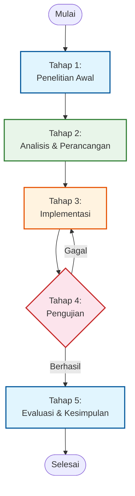
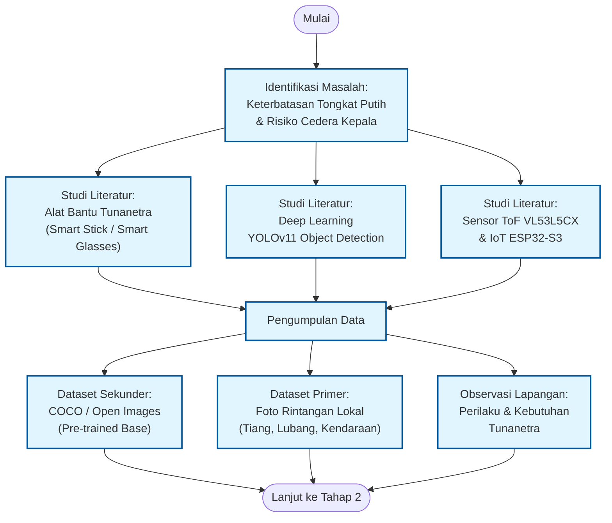
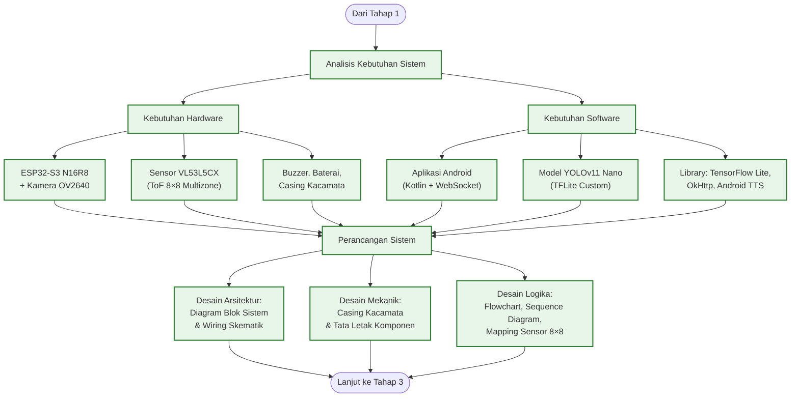
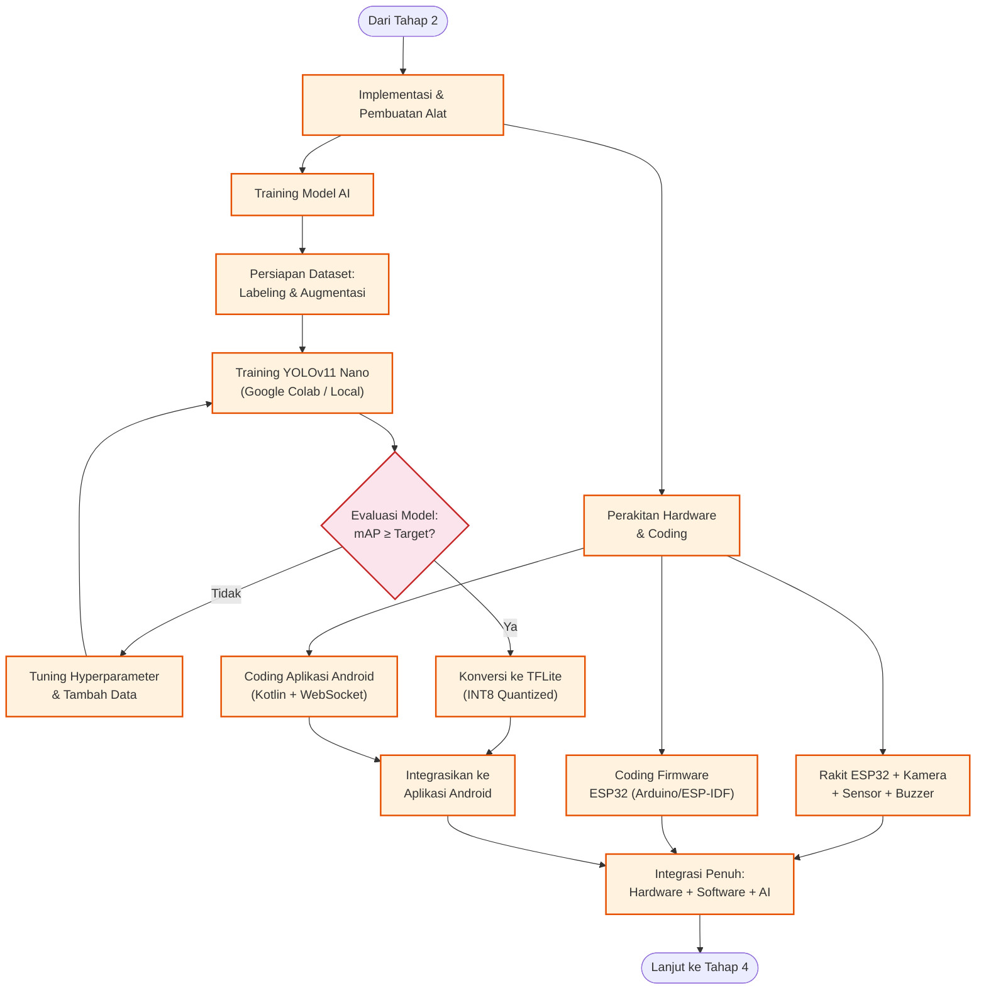
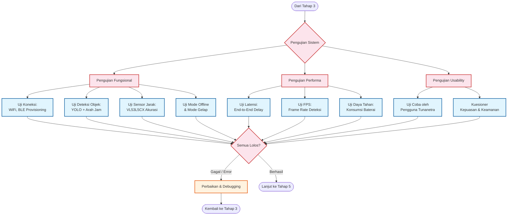
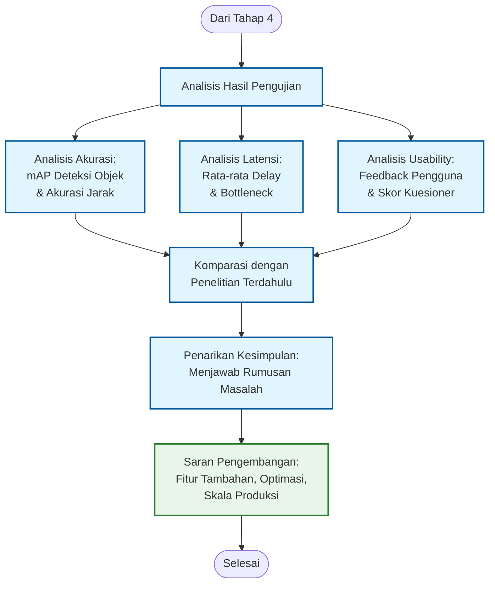

# Alur Penelitian — Metodologi Skripsi

Dokumen ini menjelaskan alur penelitian secara keseluruhan, dimulai dari flowchart garis besar lalu dipecah menjadi detail per tahapan.

---

## 0. Garis Besar Alur Penelitian

Flowchart berikut menunjukkan **tahapan utama** penelitian secara ringkas. Setiap tahapan memiliki flowchart detail di bagian selanjutnya.

**Penjelasan garis besar:**

| Tahap | Nama | Isi Utama |
|---|---|---|
| 1 | Penelitian Awal | Identifikasi masalah, studi literatur, pengumpulan data |
| 2 | Analisis & Perancangan | Analisis kebutuhan HW/SW, desain arsitektur/mekanik/logika |
| 3 | Implementasi | Training AI, perakitan hardware, coding aplikasi |
| 4 | Pengujian | Testing sistem, debugging jika gagal |
| 5 | Evaluasi & Kesimpulan | Analisis hasil, penarikan kesimpulan & saran |

---

## 1. Tahap Penelitian Awal

Tahap awal yang mencakup identifikasi masalah, kajian literatur terkait, dan pengumpulan data yang dibutuhkan.

**Penjelasan langkah demi langkah:**

1. **Identifikasi Masalah** — Penelitian dimulai dengan mengidentifikasi permasalahan utama: tongkat putih konvensional hanya mendeteksi rintangan di bawah pinggang, sehingga tunanetra rentan terhadap cedera kepala akibat rintangan setinggi kepala (tiang rambu, dahan pohon, kanopi toko).
2. **Studi Literatur** — Tiga arah kajian dilakukan secara paralel:
   - **Alat bantu tunanetra** yang sudah ada (smart stick, smart glasses), kelebihan dan kekurangannya.
   - **Deep learning YOLOv11** sebagai model object detection real-time yang ringan untuk perangkat mobile.
   - **Sensor ToF VL53L5CX** sebagai sensor jarak multizone 8×8 dan **ESP32-S3** sebagai mikrokontroler IoT dengan WiFi/BLE.
3. **Pengumpulan Data** — Tiga jenis data dikumpulkan:
   - **Dataset sekunder** (COCO/Open Images) sebagai basis pre-trained model.
   - **Dataset primer** berupa foto rintangan khas lingkungan lokal Indonesia.
   - **Observasi lapangan** untuk memahami perilaku navigasi tunanetra dan kebutuhan mereka.

---

## 2. Tahap Analisis & Perancangan

Tahap analisis kebutuhan sistem dan perancangan desain secara menyeluruh sebelum implementasi.

**Penjelasan langkah demi langkah:**

1. **Analisis Kebutuhan Sistem** — Berdasarkan hasil studi literatur dan observasi, ditentukan kebutuhan hardware dan software secara spesifik.
2. **Kebutuhan Hardware** — Tiga kelompok komponen:
   - **ESP32-S3 N16R8 + Kamera OV2640**: Mikrokontroler utama dengan kamera 2MP untuk streaming video.
   - **VL53L5CX**: Sensor jarak Time-of-Flight multizone 8×8 untuk deteksi jarak akurat.
   - **Komponen pendukung**: Buzzer untuk peringatan darurat (fail-safe), baterai untuk portabilitas, dan casing kacamata sebagai wadah wearable.
3. **Kebutuhan Software** — Tiga komponen perangkat lunak:
   - **Aplikasi Android** berbasis Kotlin dengan WebSocket untuk komunikasi real-time.
   - **Model YOLOv11 Nano** yang dikonversi ke TFLite untuk inferensi ringan di smartphone.
   - **Library pendukung**: TensorFlow Lite (AI), OkHttp (WebSocket), Android TTS (suara).
4. **Perancangan Sistem** — Tiga desain dibuat secara paralel:
   - **Arsitektur**: Diagram blok sistem (wearable ↔ smartphone ↔ user) dan wiring skematik komponen elektronik.
   - **Mekanik**: Desain casing kacamata dan penempatan fisik komponen (kamera depan, sensor ToF, ESP32).
   - **Logika**: Flowchart alur kerja sistem, sequence diagram komunikasi antar aktor, dan logika mapping sensor 8×8 ke arah jam.

---

## 3. Tahap Implementasi

Tahap pembuatan dan pengembangan sistem berdasarkan desain yang telah dirancang.

**Penjelasan langkah demi langkah:**

1. **Implementasi** — Tahap ini dibagi menjadi dua jalur paralel: training AI dan perakitan hardware.
2. **Jalur Training Model AI:**
   - **Persiapan dataset**: Labeling gambar rintangan menggunakan tools (Roboflow/CVAT), augmentasi data (rotasi, flip, brightness) untuk memperbanyak variasi.
   - **Training**: Melatih model YOLOv11 Nano menggunakan Google Colab (GPU) atau mesin lokal. Output berupa file weight model.
   - **Evaluasi**: Mengukur mAP (mean Average Precision). Jika belum mencapai target → tuning hyperparameter dan menambah data, lalu training ulang.
   - **Konversi TFLite**: Model yang lolos evaluasi dikonversi ke format TFLite dengan kuantisasi INT8 agar ringan di smartphone.
   - **Integrasi ke Android**: Model TFLite dimasukkan ke dalam aplikasi Android dan diuji inferensi dasar.
3. **Jalur Perakitan Hardware & Coding:**
   - **Rakit hardware**: Merakit ESP32-S3 dengan kamera OV2640, sensor VL53L5CX, dan buzzer ke dalam casing kacamata.
   - **Coding firmware ESP32**: Menulis kode untuk streaming video via WebSocket, membaca sensor I2C, dan mengendalikan buzzer.
   - **Coding aplikasi Android**: Membuat aplikasi Kotlin yang menerima stream video, menampilkan UI, dan menjalankan logika fusion.
4. **Integrasi Penuh** — Menggabungkan seluruh komponen: hardware yang sudah dirakit + firmware ESP32 + aplikasi Android + model AI TFLite menjadi satu sistem terintegrasi.

---

## 4. Tahap Pengujian

Tahap pengujian fungsionalitas dan performa sistem secara keseluruhan.

**Penjelasan langkah demi langkah:**

1. **Pengujian Fungsional** — Menguji apakah setiap fitur bekerja sesuai desain:
   - **Koneksi**: BLE provisioning pertama kali, WebSocket streaming setelah WiFi terhubung.
   - **Deteksi objek**: YOLO mendeteksi rintangan dengan benar dan mapping ke arah jam (10-2) akurat.
   - **Sensor jarak**: VL53L5CX menghasilkan data jarak yang akurat pada setiap zona 8×8.
   - **Mode fallback**: Mode Offline (buzzer saat WiFi putus) dan Mode Gelap (sensor only saat cahaya rendah) berfungsi.
2. **Pengujian Performa** — Mengukur metrik kuantitatif:
   - **Latensi**: Waktu dari capture frame hingga output suara TTS (end-to-end delay).
   - **FPS**: Berapa frame per detik yang berhasil diproses oleh YOLO secara real-time.
   - **Daya tahan**: Seberapa lama baterai bertahan dengan penggunaan normal.
3. **Pengujian Usability** — Menguji pengalaman pengguna sebenarnya:
   - **Uji coba** langsung oleh pengguna tunanetra dalam skenario navigasi nyata.
   - **Kuesioner** untuk mengukur tingkat kepuasan, rasa aman, dan kemudahan penggunaan.
4. **Hasil Pengujian** — Jika ada yang gagal, kembali ke Tahap 3 (Implementasi) untuk perbaikan dan debugging. Jika semua tes lolos, lanjut ke evaluasi akhir.

---

## 5. Tahap Evaluasi & Kesimpulan

Tahap akhir: menganalisis seluruh hasil pengujian, menarik kesimpulan, dan memberikan saran untuk pengembangan selanjutnya.

**Penjelasan langkah demi langkah:**

1. **Analisis Hasil Pengujian** — Data dari pengujian Tahap 4 dianalisis dalam tiga dimensi:
   - **Akurasi**: Nilai mAP (mean Average Precision) model YOLO pada dataset custom, serta akurasi pengukuran jarak sensor VL53L5CX dibandingkan jarak aktual.
   - **Latensi**: Rata-rata waktu delay end-to-end dan identifikasi bottleneck sistem (apakah di streaming, inferensi, atau TTS).
   - **Usability**: Skor kuesioner dari pengguna tunanetra dan rangkuman feedback kualitatif.
2. **Komparasi** — Hasil analisis dibandingkan dengan penelitian terdahulu di bidang yang sama (smart stick, smart glasses) untuk menunjukkan kontribusi dan keunggulan/kekurangan sistem yang dibuat.
3. **Penarikan Kesimpulan** — Menjawab setiap rumusan masalah yang telah diidentifikasi di Tahap 1 berdasarkan data hasil pengujian.
4. **Saran Pengembangan** — Rekomendasi untuk penelitian selanjutnya, misalnya: penambahan fitur GPS navigasi, optimasi model AI ke versi lebih ringan, atau desain casing yang lebih ergonomis untuk produksi massal.
