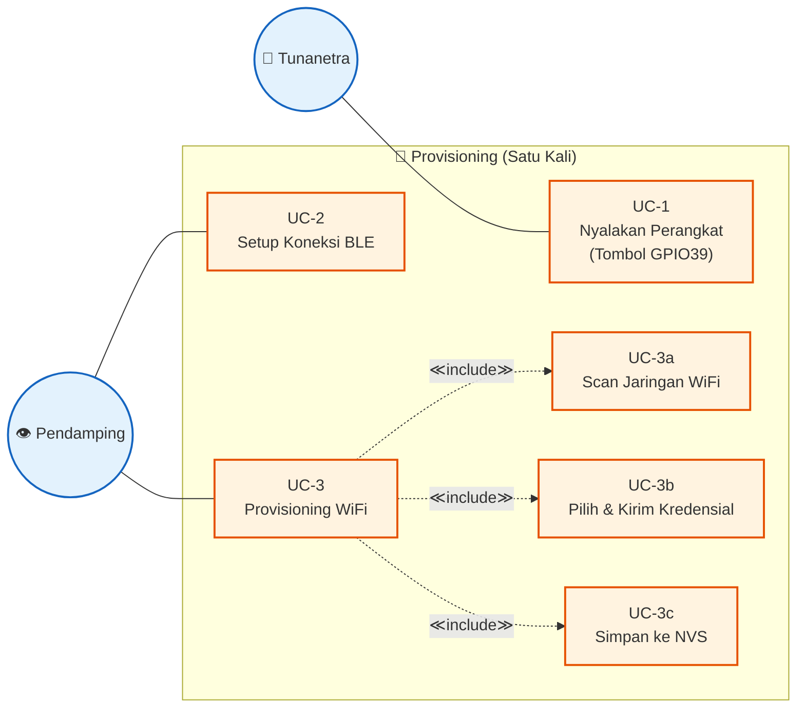
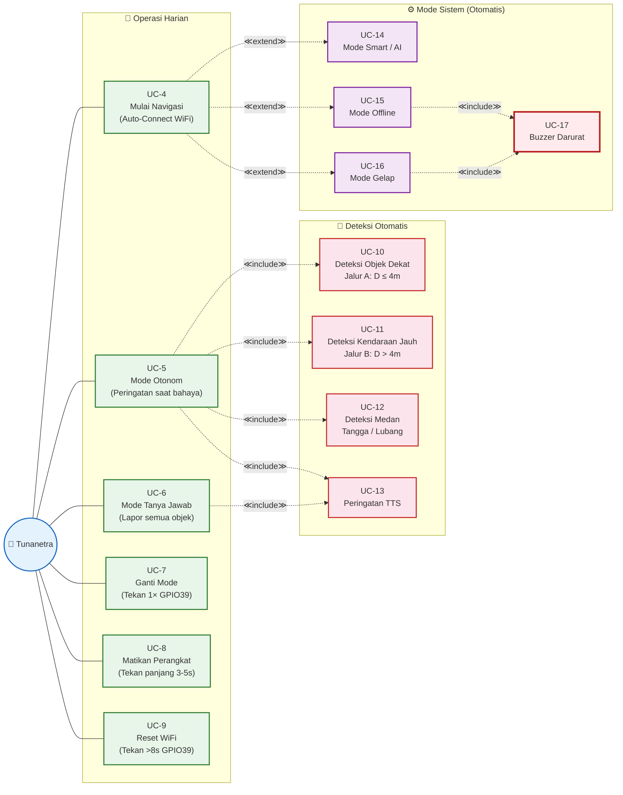
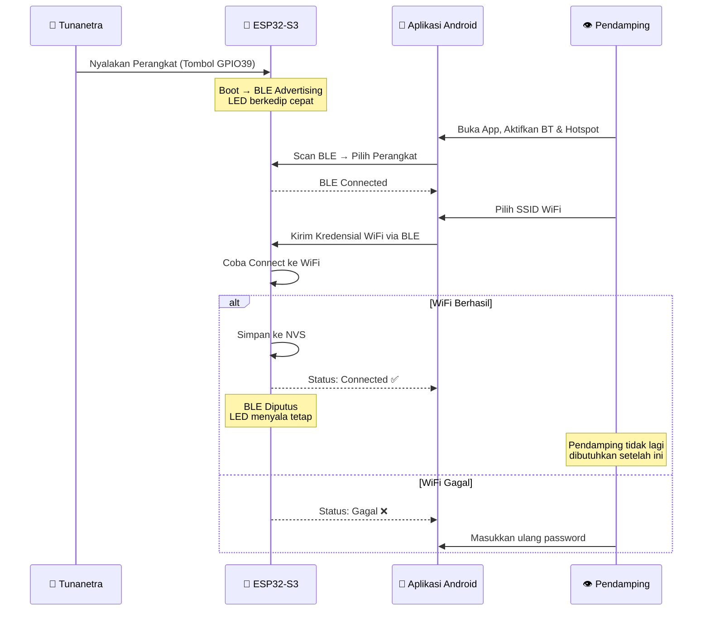
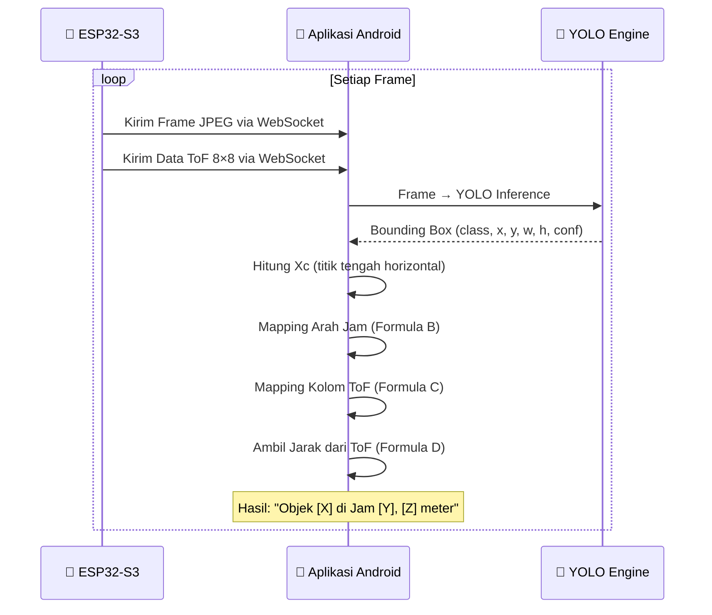
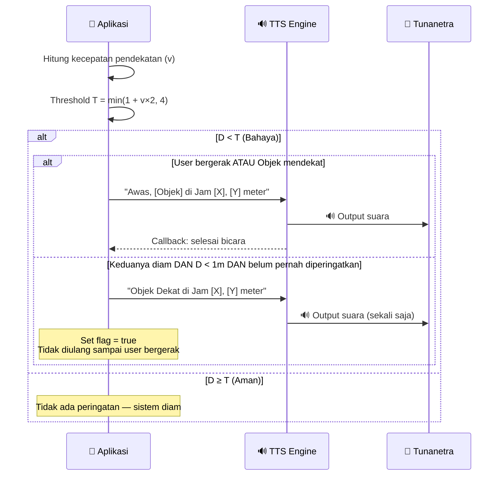
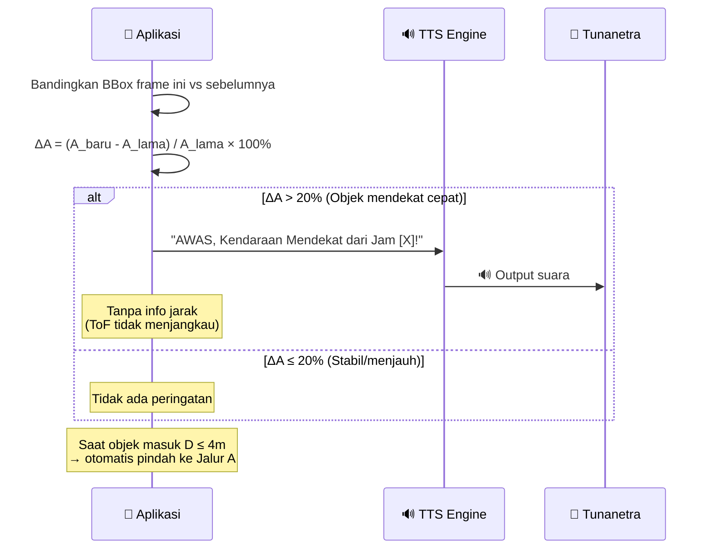
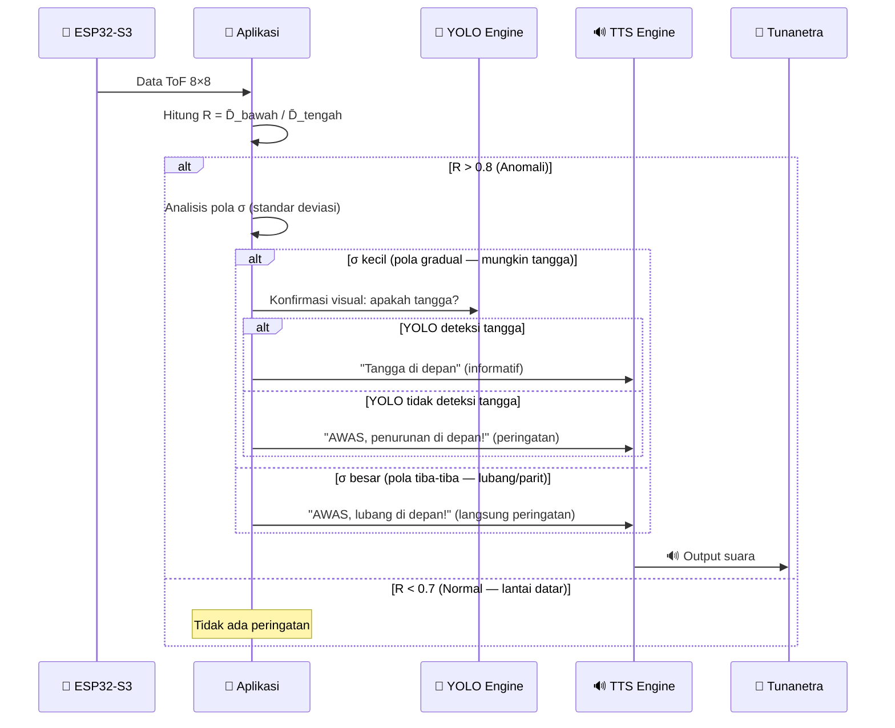
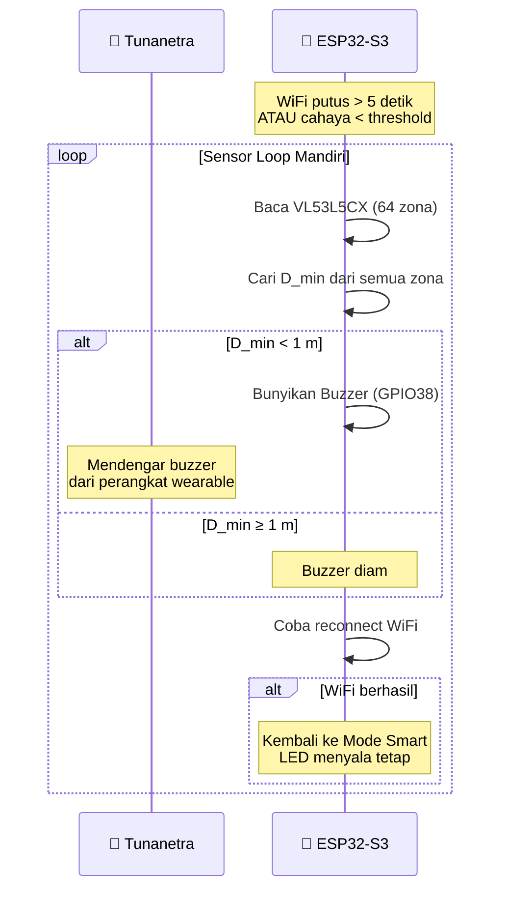
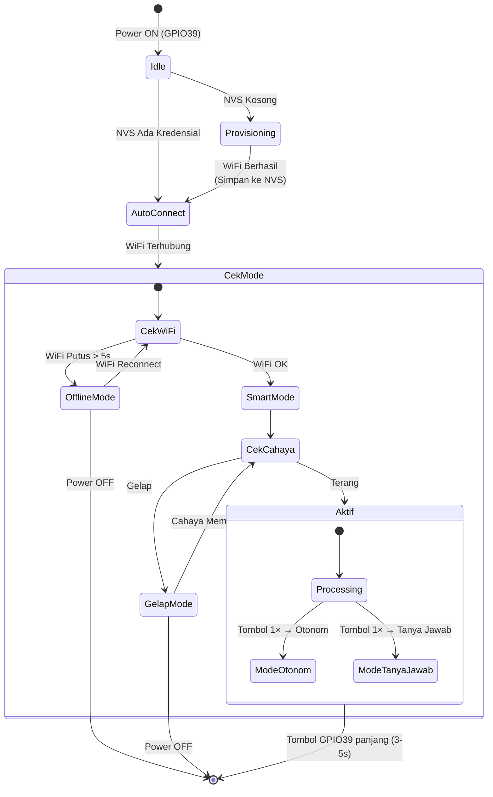
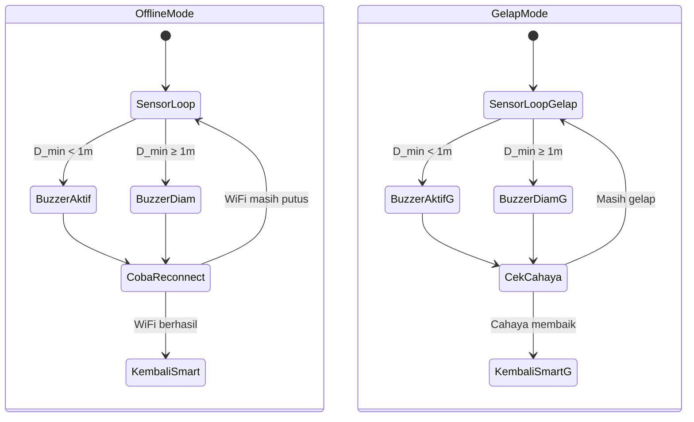

# Perancangan Diagram Sistem — Sistem Bantu Navigasi Tunanetra

Dokumen ini menyajikan **seluruh diagram perancangan sistem** secara terpadu dalam satu alur naratif, mulai dari Use Case Diagram, Sequence Diagram, State Machine Diagram, hingga potongan Flowchart yang relevan. Setiap bagian menjelaskan aspek yang **berbeda** tanpa pengulangan — Use Case menjawab *siapa melakukan apa*, Sequence menjawab *urutan komunikasi antar komponen*, State Machine menjawab *kapan status sistem berubah*, dan Flowchart menjawab *bagaimana logika keputusannya*.

---

## 3.6 Use Case Diagram

### 3.6.1 Use Case Provisioning — Peran Pendamping

Diagram berikut menampilkan interaksi **Pendamping** (sighted companion) saat melakukan setup awal perangkat. Proses provisioning **hanya dilakukan satu kali** — setelah berhasil, perangkat akan auto-connect di setiap penggunaan selanjutnya.



**Penjelasan:**

- **UC-1 — Nyalakan Perangkat**: Tunanetra menekan tombol multifungsi (GPIO39) pada gagang kacamata. ESP32-S3 boot, LED indikator (GPIO48) berkedip cepat menandakan mode BLE Provisioning aktif. Ini **satu-satunya aksi tunanetra** dalam seluruh proses provisioning.
- **UC-2 — Setup Koneksi BLE**: Pendamping menyalakan Bluetooth & WiFi Hotspot di smartphone, membuka aplikasi Android, melakukan scan BLE, dan memilih perangkat IoT. Langkah ini memerlukan **interaksi visual** dengan layar sehingga harus dilakukan pendamping.
- **UC-3 — Provisioning WiFi**: Pendamping memilih jaringan WiFi dan mengirim kredensial ke ESP32 via BLE. Terdiri dari tiga sub-proses (≪include≫):
  - **UC-3a — Scan Jaringan WiFi**: ESP32 memindai SSID sekitar dan mengirim daftar ke aplikasi via BLE.
  - **UC-3b — Pilih & Kirim Kredensial**: Pendamping memilih SSID, masukkan password, lalu kirim ke ESP32.
  - **UC-3c — Simpan ke NVS**: Setelah WiFi terhubung, kredensial disimpan ke NVS (Non-Volatile Storage) agar auto-connect di sesi berikutnya. **Setelah langkah ini, pendamping tidak lagi dibutuhkan.**

---

### 3.6.2 Use Case Operasi Harian — Interaksi Tunanetra

Diagram berikut menampilkan interaksi **Tunanetra** saat penggunaan sehari-hari. Semua interaksi melalui **satu tombol multifungsi** (GPIO39), output **suara TTS**, **LED indikator** (GPIO48), dan **buzzer** — tidak perlu melihat layar.



**Penjelasan Interaksi Tombol Multifungsi (GPIO39):**

| Pola Tekanan | Durasi | Use Case | Feedback |
|---|---|---|---|
| Tekan singkat 1× | < 1 detik | UC-7 Ganti Mode (Otonom ↔ Tanya Jawab) | TTS konfirmasi + LED berubah pola |
| Double press 2× | 2× dalam 0.5 detik | UC-6 Trigger Tanya (lapor semua objek) | TTS menyebutkan semua objek |
| Tekan panjang | 3–5 detik | UC-8 Matikan Perangkat (deep sleep) | Buzzer 2× beep + LED mati |
| Tekan sangat panjang | > 8 detik | UC-9 Reset WiFi (hapus NVS) | Buzzer 3× beep + reboot |

**Penjelasan Use Case Operasi:**

- **UC-4 — Mulai Navigasi**: Tunanetra menekan tombol → ESP32 auto-connect WiFi via NVS → LED menyala tetap → sistem otomatis memilih mode berdasarkan kondisi:
  - WiFi OK + terang → **UC-14 Mode Smart** (≪extend≫)
  - WiFi putus > 5s → **UC-15 Mode Offline** (≪extend≫)
  - WiFi OK + gelap → **UC-16 Mode Gelap** (≪extend≫)
- **UC-5 — Mode Otonom** (default): Sistem **diam saat aman**, hanya memberi peringatan saat ada bahaya melalui 3 jalur deteksi paralel (UC-10, UC-11, UC-12).
- **UC-6 — Mode Tanya Jawab**: Tunanetra menekan 2× cepat → TTS menyebutkan **semua objek** beserta arah jam dan jarak.
- **UC-17 — Buzzer Darurat**: Di Mode Offline/Gelap, buzzer ESP32 berbunyi langsung saat $D_{min} < 1$ m — mekanisme fail-safe tanpa TTS.

---

## 3.7 Sequence Diagram

### 3.7.1 SD-1: Alur Komunikasi Provisioning

Sequence diagram berikut menunjukkan **urutan komunikasi** antar aktor saat provisioning. Tunanetra hanya menekan tombol, semua langkah visual dilakukan pendamping.



**Poin penting yang tidak dibahas di Use Case:**
1. **BLE diputus setelah WiFi berhasil** — kanal BLE hanya dipakai saat provisioning, setelah itu ESP32 berkomunikasi penuh via WiFi (WebSocket).
2. **Kredensial disimpan permanen di NVS** — sehingga pada boot berikutnya, ESP32 langsung auto-connect tanpa BLE.
3. **Jika WiFi gagal**, pendamping bisa langsung memasukkan ulang password tanpa restart perangkat.

---

### 3.7.2 SD-2: Alur Data Real-Time (Mode Smart)

Setelah provisioning berhasil dan sistem masuk Mode Smart, berikut adalah **alur data per-frame video** dari kamera hingga output TTS.



**Poin penting yang berbeda dari Use Case:**
1. **Dua jenis data dikirim bersamaan** dari ESP32: frame video (JPEG) dan matriks sensor ToF (8×8) — keduanya via WebSocket.
2. **Proses mapping sepenuhnya di smartphone**: Titik tengah bounding box ($X_c$) dipetakan ke arah jam (Formula B), lalu indeks kolom ToF (Formula C) digunakan untuk mengambil jarak presisi (Formula D).
3. **YOLO inference berjalan di HP** menggunakan TFLite GPU Delegate — bukan di ESP32. ESP32 hanya mengirim data mentah.

---

### 3.7.3 SD-3a: Alur Peringatan Jalur A (Objek Dekat, D ≤ 4m)

Saat objek terdeteksi dalam jangkauan sensor ToF, sistem menghitung threshold adaptif untuk menentukan apakah peringatan perlu diberikan.



**Poin penting:**
1. **Threshold dinamis** — Semakin cepat user/objek bergerak, semakin jauh jarak peringatan. User berjalan 1.5 m/s → $T = 4$ m (peringatan dari 4 meter). User diam → $T = 1$ m (tidak mengganggu).
2. **Anti-spam saat statis** — Jika user dan objek sama-sama diam pada jarak < 1 meter, peringatan diberikan **satu kali saja** (flag). Flag reset saat user bergerak.
3. **Callback mechanism** — TTS mengirim callback setelah selesai bicara. Peringatan berikutnya menunggu callback ini — mencegah suara bertumpuk.

---

### 3.7.4 SD-3b: Alur Peringatan Jalur B (Kendaraan Jauh, D > 4m)

Untuk objek di luar jangkauan ToF, sistem menggunakan perubahan ukuran bounding box YOLO sebagai indikator pendekatan.



**Poin penting:**
1. **Tidak ada jarak** — Peringatan hanya menyebutkan arah jam, bukan jarak, karena sensor ToF tidak menjangkau > 4 meter.
2. **Transisi otomatis** — Saat objek terus mendekat dan masuk jangkauan ToF ($D \le 4$ m), sistem otomatis beralih ke Jalur A yang memberikan jarak presisi.

---

### 3.7.5 SD-3c: Alur Deteksi Medan (Tangga/Lubang)

Sensor ToF menganalisis perbedaan jarak antar zona untuk mendeteksi perubahan elevasi lantai di depan user.



**Poin penting:**
1. **Dua langkah analisis** — Rasio $R$ mendeteksi anomali, lalu standar deviasi $\sigma$ membedakan pola gradual (tangga) vs tiba-tiba (lubang).
2. **Konfirmasi visual** — Untuk pola gradual, YOLO diminta konfirmasi. Jika YOLO bilang tangga → informasi netral ("Tangga di depan"). Jika bukan tangga → peringatan ("AWAS, penurunan!").
3. **Lubang langsung peringatan** — Pola tiba-tiba ($\sigma$ besar) dianggap berbahaya tanpa perlu konfirmasi YOLO.

---

### 3.7.6 SD-4: Alur Mode Darurat (Offline & Gelap)

Saat WiFi putus atau cahaya kurang, sistem beralih ke mekanisme fail-safe menggunakan buzzer fisik pada ESP32.



**Poin penting:**
1. **ESP32 beroperasi mandiri** — Tidak ada smartphone, tidak ada YOLO, tidak ada TTS. Hanya sensor ToF + buzzer.
2. **Threshold tetap 1 meter** — Tidak adaptif, karena accelerometer di HP tidak terjangkau. Angka 1 meter dipilih sebagai jarak aman minimum universal.
3. **Reconnect otomatis** — Setiap siklus sensor, ESP32 mencoba reconnect WiFi. Jika berhasil → kembali ke Mode Smart.

---

## 3.8 State Machine Diagram

### 3.8.1 SM-1: Transisi Mode Keseluruhan Sistem

State machine menunjukkan **semua state** yang mungkin dialami sistem dan **trigger** yang menyebabkan perpindahan antar state.



**Penjelasan transisi yang belum dibahas di diagram sebelumnya:**
1. **Idle → Provisioning vs AutoConnect**: Saat power ON, ESP32 memeriksa NVS. Jika kosong → BLE Provisioning. Jika sudah ada kredensial → langsung auto-connect WiFi.
2. **Transisi antar Mode bersifat otomatis**: User **tidak memilih** Mode Smart/Offline/Gelap — sistem menentukan sendiri berdasarkan status WiFi dan cahaya.
3. **Transisi mode aplikasi (Otonom ↔ Tanya Jawab)**: Ini satu-satunya transisi yang **dikendalikan user** lewat tombol GPIO39 (tekan 1× singkat).
4. **Feedback LED** menunjukkan state saat ini: solid (Smart), kedip lambat (Darurat), kedip cepat (Provisioning), 2× kedip + jeda (Tanya Jawab).

---

### 3.8.2 SM-2: State Detail Mode Smart (Pemrosesan Paralel)

Saat sistem dalam Mode Smart, tiga jalur deteksi berjalan **bersamaan secara paralel**.

```mermaid
stateDiagram
    state SmartMode {
        [*] --> CekModeApp

        state CekModeApp {
            [*] --> Otonom
            Otonom --> TanyaJawab: Tekan 1× GPIO39
            TanyaJawab --> Otonom: Tekan 1× GPIO39
        }

        state ModeOtonom {
            state DeteksiParalel {
                JalurA: Jalur A\nObjek Dekat (D ≤ 4m)\nThreshold Adaptif
                JalurB: Jalur B\nKendaraan Jauh (D > 4m)\nDelta BBox YOLO
                JalurC: Jalur C\nDeteksi Medan\nRasio ToF R
            }
        }

        Otonom --> DeteksiParalel
        TanyaJawab --> LaporSemua: Tekan 2× GPIO39
        LaporSemua --> TanyaJawab: TTS selesai
    }

    SmartMode --> Paused: User diam > 10 detik
    Paused --> SmartMode: User bergerak
    Note right of Paused: YOLO di-pause\nToF + Buzzer tetap aktif
```

**Poin penting:**
1. **User diam > 10 detik → YOLO di-pause** untuk hemat daya baterai dan CPU HP. Namun sensor ToF + buzzer **tetap aktif** di ESP32 untuk keamanan.
2. **Tiga jalur paralel** tidak saling mengganggu — Jalur A, B, dan C berjalan bersamaan di setiap frame.

---

### 3.8.3 SM-3: State Detail Mode Darurat



**Perbedaan antara Mode Offline dan Mode Gelap:**

| Aspek | Mode Offline | Mode Gelap |
|---|---|---|
| **Trigger masuk** | WiFi putus > 5 detik | Cahaya < threshold |
| **Kamera** | Dimatikan total | Low FPS (cek brightness berkala) |
| **Cara keluar** | WiFi reconnect | Cahaya membaik ($B_{cam} \ge B_{threshold}$) |
| **Logika buzzer** | Identik ($D_{min} < 1$ m) | Identik ($D_{min} < 1$ m) |
| **LED indikator** | Berkedip lambat | Berkedip lambat |

---

## 3.9 Ringkasan Relasi Antar Diagram

Tabel berikut menunjukkan bagaimana setiap fitur diwakilkan di masing-masing diagram, sehingga pembaca tahu **di mana mencari detail** tanpa harus membaca ulang penjelasan yang sama.

| Fitur Sistem | Use Case (3.6) | Sequence (3.7) | State Machine (3.8) | Flowchart (3.5) | Formula (3.5.1) |
|---|---|---|---|---|---|
| **Provisioning** | UC-1, UC-2, UC-3 | SD-1 (3.7.1) | SM-1: Idle→Provisioning | Flowchart 3.5.2 | — |
| **Penentuan Mode** | UC-4 (extend) | — | SM-1: CekMode | Flowchart 3.5.3 | — |
| **Mapping Objek** | — | SD-2 (3.7.2) | — | Flowchart 3a (3.5.4) | Formula A, B, C, D |
| **Deteksi Dekat (Jalur A)** | UC-10 | SD-3a (3.7.3) | SM-2: JalurA | Flowchart 3c (3.5.4) | Formula E, F, J |
| **Deteksi Kendaraan (Jalur B)** | UC-11 | SD-3b (3.7.4) | SM-2: JalurB | Flowchart 3d (3.5.4) | Formula G |
| **Deteksi Medan (Jalur C)** | UC-12 | SD-3c (3.7.5) | SM-2: JalurC | Flowchart 3e (3.5.4) | Formula H |
| **Mode Darurat** | UC-15, UC-16, UC-17 | SD-4 (3.7.6) | SM-3 | Flowchart 3.5.5 | Formula I |
| **Ganti Mode** | UC-7 | — | SM-2: CekModeApp | — | — |
| **Matikan Perangkat** | UC-8 | — | SM-1: →[*] | — | — |
| **Reset WiFi** | UC-9 | — | SM-1: →Provisioning | — | — |
| **Buzzer Darurat** | UC-17 | SD-4 | SM-3: BuzzerAktif | Flowchart 3.5.5 | Formula I |
