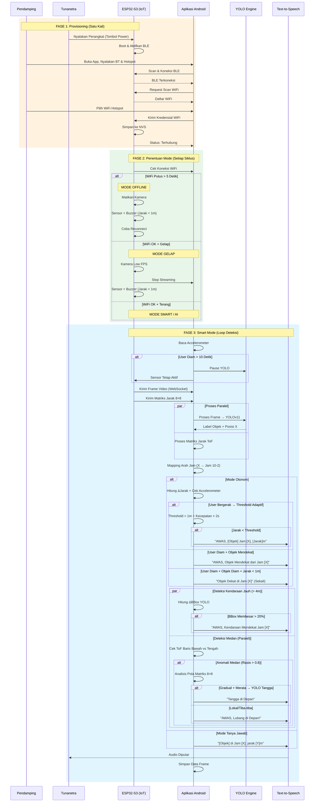
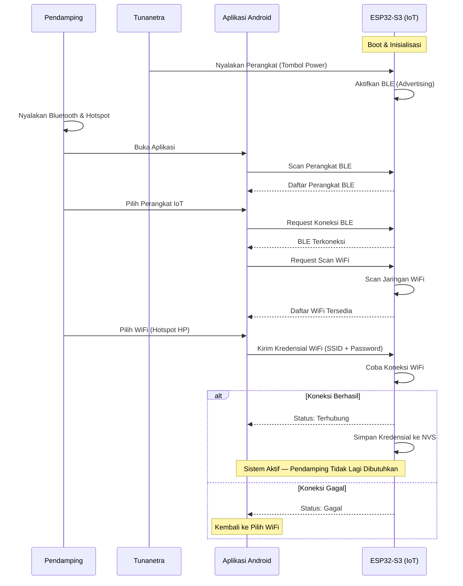
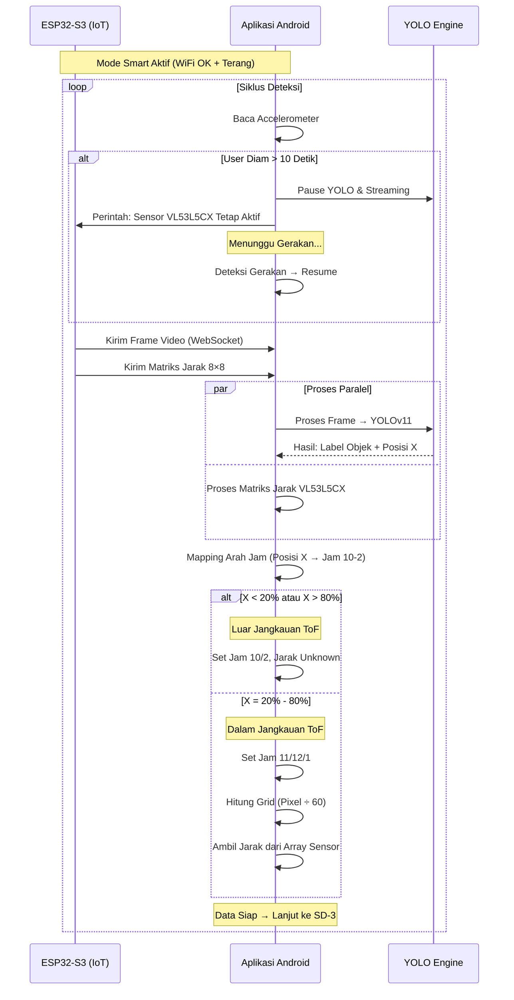
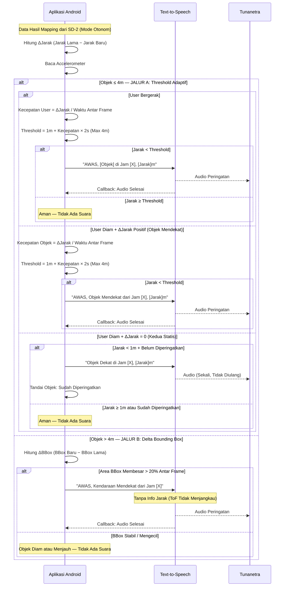
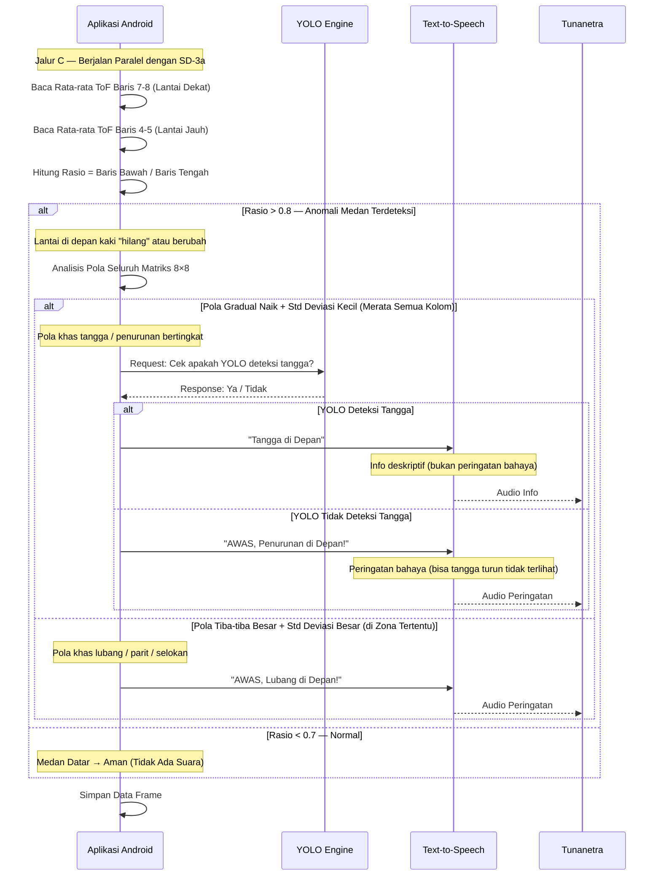
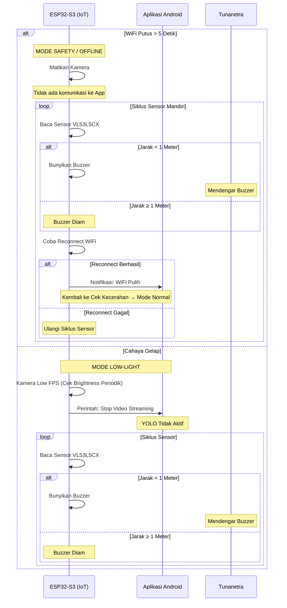
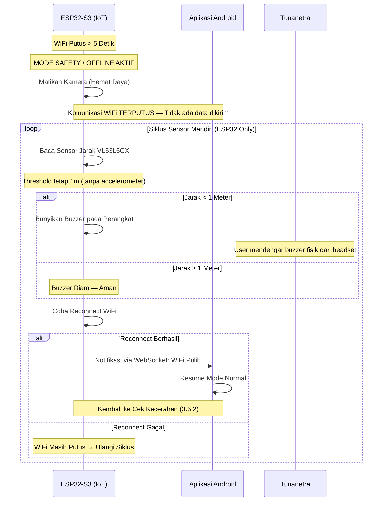
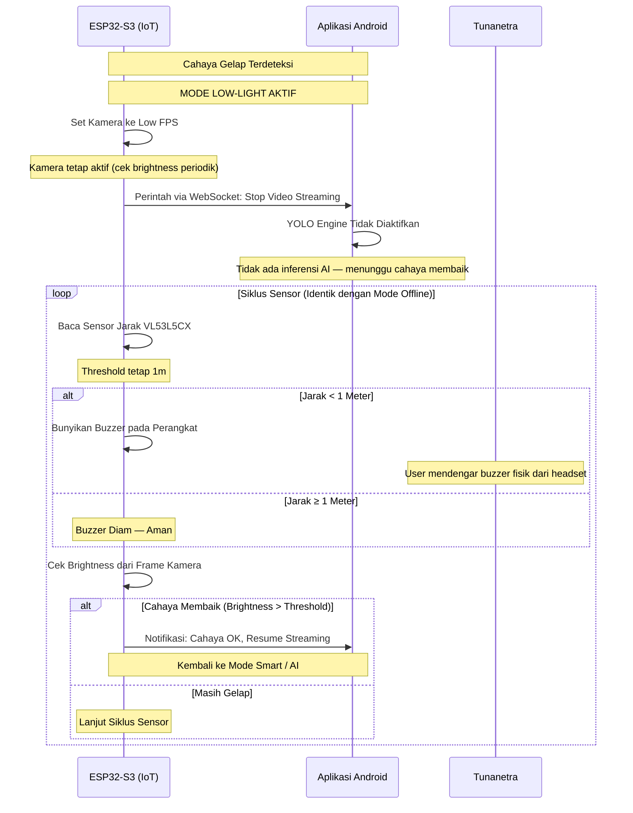

```mermaid
sequenceDiagram
    participant App as Aplikasi Android
    participant AI as YOLO Engine
    participant TTS as Text-to-Speech
    participant TN as Tunanetra

    Note over App: Menerima Data Hasil Mapping dari SD-2

    alt Mode Otonom
        par Jalur A + B: Deteksi Objek
            App->>App: Hitung ΔJarak (Jarak Lama − Jarak Baru)
            App->>App: Baca Accelerometer

            alt Objek Dalam Jangkauan ToF (≤ 4m)
                Note over App: JALUR A: Threshold Adaptif

                alt User Bergerak
                    App->>App: Kecepatan = ΔJarak / Waktu
                    App->>App: Threshold = 1m + Kecepatan × 2s (Max 4m)
                    alt Jarak < Threshold
                        App->>TTS: "AWAS, [Objek] di Jam [X], [Jarak]m"
                        TTS-->>TN: Audio Peringatan
                    else Jarak ≥ Threshold
                        Note over App: Aman — Diam
                    end

                else User Diam + ΔJarak Positif (Objek Mendekat)
                    App->>App: Kecepatan Objek = ΔJarak / Waktu
                    App->>App: Threshold = 1m + Kecepatan × 2s
                    alt Jarak < Threshold
                        App->>TTS: "AWAS, Objek Mendekat dari Jam [X], [Jarak]m"
                        TTS-->>TN: Audio Peringatan
                    end

                else User Diam + ΔJarak = 0 (Kedua Statis)
                    alt Jarak < 1m + Belum Diperingatkan
                        App->>TTS: "Objek Dekat di Jam [X], [Jarak]m"
                        TTS-->>TN: Audio Peringatan (Sekali)
                        App->>App: Tandai: Sudah Diperingatkan
                    end
                end

            else Objek Diluar Jangkauan ToF (> 4m)
                Note over App: JALUR B: Delta Bounding Box
                App->>App: Hitung ΔBBox (BBox Baru − BBox Lama)
                alt Area BBox Membesar > 20%
                    App->>TTS: "AWAS, Kendaraan Mendekat dari Jam [X]"
                    TTS-->>TN: Audio Peringatan
                else BBox Stabil / Mengecil
                    Note over App: Aman — Diam
                end
            end

        and Jalur C: Deteksi Medan (Paralel)
            App->>App: Baca ToF Baris 7-8, Bandingkan Baris 4-5

            alt Rasio Bawah/Tengah > 0.8 (Anomali)
                App->>App: Analisis Pola Seluruh Matriks 8×8

                alt Gradual Naik + Merata Semua Kolom
                    App->>AI: Cek YOLO: Tangga?
                    alt YOLO Deteksi Tangga
                        App->>TTS: "Tangga di Depan"
                        TTS-->>TN: Audio Info
                    else Tidak Terdeteksi
                        App->>TTS: "AWAS, Penurunan di Depan!"
                        TTS-->>TN: Audio Peringatan
                    end

                else Tiba-tiba Besar di Zona Tertentu
                    App->>TTS: "AWAS, Lubang di Depan!"
                    TTS-->>TN: Audio Peringatan
                end

            else Rasio Normal (< 0.7)
                Note over App: Medan Aman
            end
        end

    else Mode Tanya Jawab
        App->>TTS: "[Objek] di arah Jam [X], jarak [Y]m"
        TTS-->>TN: Audio Info
    end

    App->>App: Simpan Data Frame (Jarak + BBox)
    App->>App: Kembali ke Cek WiFi (3.5.2)
```

# Sequence Diagram - Sistem Kerja Perangkat

Dokumen ini menyajikan alur kerja perangkat IoT bantu navigasi tunanetra dalam bentuk **sequence diagram**. Fokus utama sequence diagram adalah **komunikasi dan urutan waktu antar aktor**: siapa mengirim data ke siapa, apa isi datanya, dan kapan komunikasi tersebut terjadi.

Dokumen ini sesuai dengan **sub-bab 3.6 Perancangan Interaksi dan Protokol Komunikasi** pada BAB 3 skripsi.

**Aktor dalam sistem:**

| Aktor | Peran |
|---|---|
| **Tunanetra** | Pengguna utama yang mengoperasikan perangkat via tombol & suara |
| **Pendamping** | *Sighted companion* yang membantu setup awal (provisioning) |
| **ESP32-S3 (IoT)** | Perangkat wearable yang mengirim data sensor & video |
| **Aplikasi Android** | Smartphone yang menerima, memproses, dan menghasilkan output |
| **YOLO Engine** | Modul AI YOLOv11 Nano (TFLite) di smartphone |
| **Text-to-Speech** | Modul suara Android untuk feedback audio ke user |

---

## Sequence Diagram Gabungan: Keseluruhan Sistem

Diagram berikut menampilkan **keseluruhan alur komunikasi** dari provisioning hingga operasi normal, termasuk mode darurat, dalam satu gambar.

Diagram di atas menampilkan keseluruhan komunikasi. Karena terlalu besar untuk A4, dipecah menjadi **empat diagram** berikut:

| Diagram | Fokus | Aktor Utama |
|---|---|---|
| **SD-1** | Provisioning (Setup Awal) | Pendamping, App, IoT |
| **SD-2** | Pemrosesan Data & Mapping | IoT, App, YOLO |
| **SD-3** | Keputusan Output & Deteksi | App, TTS |
| **SD-4** | Mode Offline & Mode Gelap | IoT, App |

---

## SD-1. Provisioning (Koneksi Pertama Kali)

Sequence diagram ini menunjukkan alur komunikasi antara **Pendamping**, **Aplikasi Android**, dan **Perangkat IoT** saat proses provisioning WiFi via BLE. Tunanetra hanya menekan tombol power.

**Penjelasan komunikasi antar aktor:**

1. **Tunanetra → IoT** (Aksi Fisik): Tunanetra menekan tombol power — satu-satunya interaksi tunanetra saat provisioning. ESP32 boot dan mengaktifkan BLE secara internal.
2. **Pendamping → App** (Input Visual): Semua interaksi yang memerlukan layar dilakukan oleh pendamping: menyalakan BT/Hotspot, membuka app, memilih perangkat BLE, dan memilih WiFi.
3. **App ↔ IoT** (Komunikasi BLE): Koneksi dua arah via BLE digunakan hanya untuk provisioning — scanning perangkat, scanning WiFi, dan pengiriman kredensial. Setelah WiFi terhubung, kanal BLE dapat diputus.
4. **IoT → IoT** (Internal): Simpan kredensial ke NVS agar auto-connect di sesi berikutnya. Setelah langkah ini, **pendamping tidak lagi dibutuhkan** — sistem beroperasi mandiri.

> **Referensi:** Flowchart provisioning di [alur-logika.md](file:///d:/Project/Skripsi/docs/alur-logika.md) — sub-bab 3.5.1.

---

## SD-2. Pemrosesan Data & Mapping (Smart Mode)

Sequence diagram ini menunjukkan alur komunikasi data dari **ESP32 ke Smartphone**, pemrosesan paralel YOLO + ToF, dan logika mapping arah jam.

**Penjelasan komunikasi antar aktor:**

1. **App → App** (Internal): Setiap awal siklus, aplikasi membaca sensor accelerometer bawaan smartphone. Tidak ada komunikasi ke aktor lain.
2. **App → AI & App → IoT** (Perintah Pause): Saat user diam > 10 detik, aplikasi mengirimkan perintah pause ke YOLO Engine dan perintah ke IoT agar tetap menjalankan sensor VL53L5CX + buzzer secara mandiri.
3. **IoT → App** (Streaming Data): ESP32 mengirimkan dua jenis data via **WebSocket** (protokol real-time over WiFi):
   - **Frame video**: Dikirim sebagai binary JPEG dari kamera OV2640, satu frame per siklus.
   - **Matriks jarak 8×8**: Dikirim sebagai JSON array berisi 64 elemen (nilai jarak dalam milimeter) dari sensor VL53L5CX.
   - Kedua data dikirim dalam satu siklus, dengan delay minimal antar pengiriman (~ms).
4. **App → AI** (Inferensi Paralel): Aplikasi mengirimkan frame ke YOLO Engine dan memproses matriks ToF secara bersamaan (`par`). Total latency = max(YOLO, ToF), bukan YOLO + ToF.
5. **App → App** (Mapping Internal): Posisi X dari YOLO dipetakan ke arah jam. Objek di tepi frame (X < 20% atau > 80%) tidak memiliki data jarak ToF karena FoV sensor lebih sempit dari FoV kamera.

> **Referensi:** Flowchart pemrosesan di [alur-logika.md](file:///d:/Project/Skripsi/docs/alur-logika.md) — sub-bab 3.5.3 (Flowchart 3a).

---

## SD-3. Keputusan Output & Deteksi (Smart Mode)

Sequence diagram ini menunjukkan **tiga jalur deteksi paralel** pada Mode Otonom dan output Mode Tanya Jawab, termasuk threshold adaptif dan deteksi medan.

Diagram di atas cukup besar. Berikut dipecah menjadi dua bagian:

---

### SD-3a. Deteksi Objek (Jalur A + Jalur B)

Fokus pada **deteksi objek** dengan threshold adaptif (≤ 4m) dan delta bounding box (> 4m).

**Penjelasan komunikasi antar aktor:**

1. **App → App** (Internal — Tiga Cabang Accelerometer):
   - **User bergerak**: User mendekati objek statis. Kecepatan pendekatan dihitung dari delta jarak ToF. Threshold adaptif: `1m + (Kecepatan × 2 detik)`, maksimum 4m. Contoh: user berjalan 1 m/s → threshold 3m.
   - **User diam + objek mendekat (ΔJarak positif)**: Objek bergerak mendekati user (misalnya kendaraan). Threshold adaptif berdasarkan kecepatan objek.
   - **User diam + objek diam (ΔJarak = 0)**: Kedua statis. Jika jarak < 1m, peringatan diberikan **satu kali saja**. Aplikasi menandai objek tersebut agar tidak diulang. Tanda di-reset saat user bergerak atau objek berubah posisi.
2. **App → App** (Internal — Jalur B): Untuk objek di luar jangkauan ToF (> 4m), hanya bisa mendeteksi pendekatan via perubahan ukuran bounding box YOLO. Peringatan **tanpa info jarak** karena ToF tidak menjangkau. Saat objek masuk jangkauan ≤ 4m, sistem otomatis beralih ke Jalur A.
3. **App → TTS → Tunanetra** (Output Suara): Setiap pesan dikirim ke modul TTS Android sebagai string teks. TTS mengkonversi ke audio dan memutarnya. Setelah selesai, TTS mengirim **callback** ke aplikasi — aplikasi menunggu callback ini sebelum mengirim pesan TTS berikutnya, sehingga **tidak terjadi tumpang tindih suara**.

> **Referensi:** [alur-logika.md](file:///d:/Project/Skripsi/docs/alur-logika.md) — sub-bab 3.5.3 (Flowchart 3c & 3d).

---

### SD-3b. Deteksi Medan (Jalur C)

Fokus pada **deteksi perubahan medan** (tangga, lubang, penurunan) menggunakan analisis pola ToF + konfirmasi YOLO. Jalur ini berjalan **paralel** dengan SD-3a setiap frame.

**Penjelasan komunikasi antar aktor:**

1. **App → App** (Internal — Analisis ToF): Aplikasi membandingkan rata-rata jarak baris bawah (7-8, melihat lantai dekat kaki) dengan baris tengah (4-5, melihat lantai lebih jauh). Pada lantai datar, baris bawah harusnya **lebih dekat** (rasio < 0.7). Jika rasio > 0.8, berarti lantai di depan kaki "hilang" — ada perubahan elevasi.
2. **App → App** (Internal — Pattern Recognition): Analisis pola seluruh matriks 8×8 membedakan dua kondisi:
   - **Gradual + merata**: Jarak bertambah bertahap dan merata di semua kolom (std deviasi kecil) → kemungkinan tangga atau penurunan bertingkat. Perlu konfirmasi visual.
   - **Tiba-tiba + lokal**: Jarak melonjak hanya di beberapa kolom (std deviasi besar) → kemungkinan lubang, parit, atau selokan. Langsung peringatan tanpa konfirmasi visual.
3. **App → AI** (Request Konfirmasi YOLO): Satu-satunya komunikasi ke YOLO Engine di Jalur C — meminta konfirmasi visual apakah pola gradual tersebut adalah tangga. Ini penting karena ToF saja tidak bisa membedakan tangga dari penurunan tanpa anak tangga.
4. **Pesan TTS yang Berbeda**: Tangga → info deskriptif (*"Tangga di depan"*). Lubang/penurunan → peringatan bahaya (*"AWAS!"*). Perbedaan ini penting agar user tahu tingkat urgensi.

> **Referensi:** [alur-logika.md](file:///d:/Project/Skripsi/docs/alur-logika.md) — sub-bab 3.5.3 (Flowchart 3e).

---

## SD-4. Mode Offline & Mode Gelap (Darurat)

Sequence diagram ini menunjukkan komunikasi saat kondisi non-ideal. Pola komunikasi **berubah drastis** — ESP32 beroperasi mandiri, komunikasi App ↔ IoT terbatas atau tidak ada.

Berikut dipecah menjadi dua bagian:

---

### SD-4a. Mode Offline / Safety (WiFi Putus)

Fokus pada komunikasi saat **WiFi terputus**. ESP32 beroperasi **sepenuhnya mandiri** — tidak ada komunikasi ke smartphone.

**Penjelasan komunikasi antar aktor:**

1. **IoT → IoT** (Internal — Matikan Kamera): Kamera dimatikan karena tanpa WiFi, frame video tidak bisa dikirim ke smartphone untuk diproses YOLO. Penghematan daya signifikan.
2. **Tidak Ada Komunikasi IoT ↔ App**: Selama WiFi putus, **tidak ada data apapun** yang berpindah antara ESP32 dan smartphone. ESP32 beroperasi sepenuhnya mandiri.
3. **Threshold Tetap 1 Meter**: Berbeda dengan Mode Smart yang menggunakan threshold adaptif (1m–4m), mode offline hanya menggunakan **1 meter tetap**. Alasan: tanpa smartphone, tidak ada data accelerometer untuk menghitung kecepatan pendekatan, dan tidak ada YOLO untuk identifikasi objek. Threshold 1m dipilih sebagai jarak aman minimum untuk pejalan kaki.
4. **IoT → IoT** (Internal — Buzzer): Buzzer dibunyikan langsung oleh ESP32 tanpa melalui smartphone. Ini mekanisme **fail-safe terakhir** — output berupa bunyi fisik dari perangkat wearable, bukan TTS dari HP.
5. **IoT → IoT → App** (Reconnect): ESP32 secara periodik mencoba koneksi WiFi. Saat berhasil, mengirim satu notifikasi ke App via WebSocket, lalu sistem kembali ke mode normal.

> **Referensi:** [alur-logika.md](file:///d:/Project/Skripsi/docs/alur-logika.md) — sub-bab 3.5.4 (Mode Offline).

---

### SD-4b. Mode Gelap / Low-Light (Cahaya Tidak Cukup)

Fokus pada komunikasi saat **cahaya terlalu gelap** untuk YOLO. WiFi masih terhubung, tapi video streaming dihentikan.

**Penjelasan komunikasi antar aktor:**

1. **IoT → IoT** (Internal — Kamera Low FPS): Berbeda dengan Mode Offline yang mematikan kamera, Mode Gelap **tetap menyalakan kamera** pada FPS rendah. Tujuannya untuk mengecek brightness secara periodik — jika cahaya membaik, sistem bisa segera kembali ke Mode Smart.
2. **IoT → App** (Stop Streaming): Satu pesan via WebSocket dikirim dari ESP32 ke App untuk menghentikan penerimaan video stream. Setelah ini, App tahu untuk **tidak mengaktifkan YOLO Engine** — menghemat baterai HP.
3. **Siklus Sensor Identik**: Logika buzzer (jarak < 1m) identik dengan Mode Offline. Threshold tetap 1 meter dengan alasan yang sama: kecepatan pendekatan tidak dapat dihitung tanpa YOLO/accelerometer aktif.
4. **Transisi Keluar**: Saat kamera mendeteksi brightness di atas threshold, IoT mengirim notifikasi ke App untuk resume streaming → sistem kembali ke Mode Smart dengan YOLO aktif.

> **Referensi:** [alur-logika.md](file:///d:/Project/Skripsi/docs/alur-logika.md) — sub-bab 3.5.4 (Mode Gelap).

Sequence diagram ini menunjukkan alur komunikasi data dari **ESP32 ke Smartphone**, pemrosesan paralel YOLO + ToF, dan logika mapping arah jam.

**Penjelasan komunikasi antar aktor:**

1. **App → App** (Internal): Setiap awal siklus, aplikasi membaca sensor accelerometer bawaan smartphone. Tidak ada komunikasi ke aktor lain.
2. **App → AI & App → IoT** (Perintah Pause): Saat user diam > 10 detik, aplikasi mengirimkan perintah pause ke YOLO Engine dan perintah ke IoT agar tetap menjalankan sensor VL53L5CX + buzzer secara mandiri.
3. **IoT → App** (Streaming Data): ESP32 mengirimkan dua jenis data via **WebSocket**: frame video dari kamera OV2640 dan matriks jarak 8×8 dari VL53L5CX.
4. **App → AI** (Inferensi Paralel): Aplikasi mengirimkan frame ke YOLO Engine dan memproses matriks ToF secara bersamaan (`par`). Total latency = max(YOLO, ToF), bukan YOLO + ToF.
5. **App → App** (Mapping Internal): Posisi X dari YOLO dipetakan ke arah jam. Objek di tepi frame (X < 20% atau > 80%) tidak memiliki data jarak ToF.

> **Referensi:** Flowchart pemrosesan di [alur-logika.md](file:///d:/Project/Skripsi/docs/alur-logika.md) — sub-bab 3.5.3 (Flowchart 3a).

---

## SD-3. Keputusan Output & Deteksi (Smart Mode)

Sequence diagram ini menunjukkan **tiga jalur deteksi paralel** pada Mode Otonom dan output Mode Tanya Jawab, termasuk threshold adaptif dan deteksi medan.

**Penjelasan komunikasi antar aktor:**

1. **App → App** (Internal — Jalur A): Aplikasi menghitung delta jarak dan membaca accelerometer secara internal. Tiga cabang:
   - **User bergerak**: Threshold adaptif dihitung berdasarkan kecepatan user. Formula: `Threshold = 1m + (Kecepatan × 2 detik)`, max 4m.
   - **User diam + objek mendekat**: Threshold adaptif berdasarkan kecepatan objek. Pesan peringatan menyebutkan "Objek Mendekat".
   - **User diam + objek statis + jarak < 1m**: Peringatan **satu kali** saja — ditandai agar tidak diulang. Reset saat user bergerak.
2. **App → App** (Internal — Jalur B): Untuk objek di luar jangkauan ToF (> 4m), aplikasi membandingkan area bounding box antar frame. Membesar > 20% → kendaraan mendekat. **Tidak ada info jarak** karena ToF tidak menjangkau.
3. **App → AI** (Request — Jalur C): Saat anomali medan terdeteksi dengan pola gradual, aplikasi meminta YOLO Engine untuk mengkonfirmasi apakah objek visual berupa tangga. Ini satu-satunya komunikasi ke AI di Jalur C.
4. **App → TTS → Tunanetra** (Output Suara): Pesan bervariasi tergantung jenis bahaya. TTS memiliki callback ke App saat selesai memutar audio — mencegah tumpang tindih suara.
5. **Tidak Ada Komunikasi (Silent)**: Saat aman, **tidak ada pesan** yang dikirim ke TTS. Ini menghemat waktu siklus dan menghindari spam suara.

> **Referensi:** Flowchart deteksi di [alur-logika.md](file:///d:/Project/Skripsi/docs/alur-logika.md) — sub-bab 3.5.3 (Flowchart 3b–3e).

---

## SD-4. Mode Offline & Mode Gelap (Darurat)

Sequence diagram ini menunjukkan komunikasi saat kondisi non-ideal. Pola komunikasi **berubah drastis** — ESP32 beroperasi mandiri, komunikasi App ↔ IoT terbatas atau tidak ada.

**Penjelasan komunikasi antar aktor:**

1. **Perubahan Pola Komunikasi**: Berbeda dengan Mode Smart di mana komunikasi IoT ↔ App sangat aktif, pada mode darurat:
   - **Mode Offline**: WiFi putus — **tidak ada komunikasi** antara IoT dan App. ESP32 sepenuhnya mandiri. Threshold tetap 1 meter karena tidak ada data accelerometer atau YOLO.
   - **Mode Gelap**: WiFi masih aktif tapi IoT mengirimkan **satu perintah stop streaming** lalu komunikasi data diminimalkan.
2. **IoT → IoT** (Internal — Buzzer): ESP32 membaca sensor VL53L5CX dan membunyikan buzzer langsung tanpa melalui smartphone. Ini mekanisme **fail-safe** terakhir — pendengaran user mendengar bunyi buzzer fisik dari perangkat.
3. **IoT → IoT** (Internal — Reconnect): Pada mode offline, ESP32 secara periodik mencoba menghubungkan ulang WiFi. Saat berhasil, mengirim notifikasi ke App untuk kembali ke Mode Normal.
4. **IoT → App** (Stop Streaming - Mode Gelap): Satu pesan via WebSocket untuk menghentikan penerimaan video stream. Setelah ini, data video tidak lagi dikirim.

> **Referensi:** Flowchart mode darurat di [alur-logika.md](file:///d:/Project/Skripsi/docs/alur-logika.md) — sub-bab 3.5.4.
