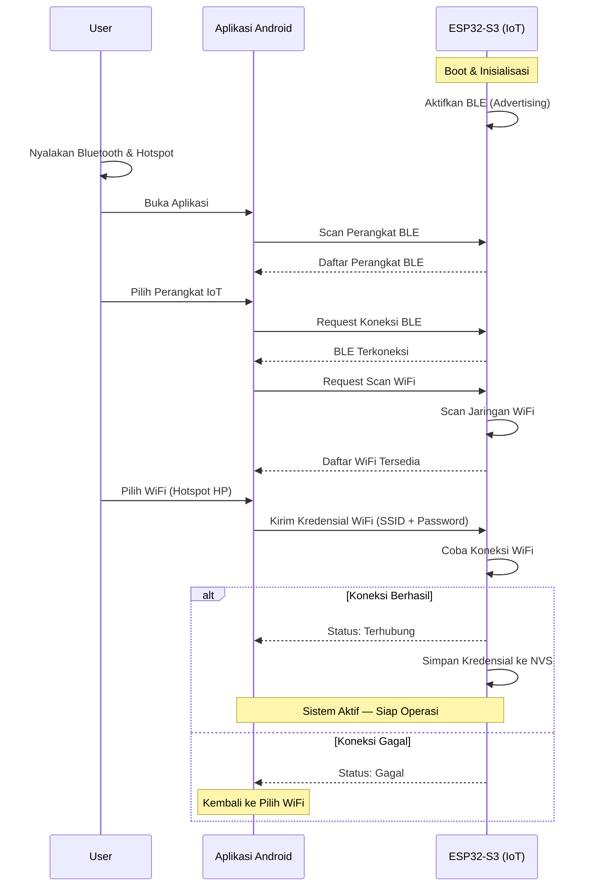
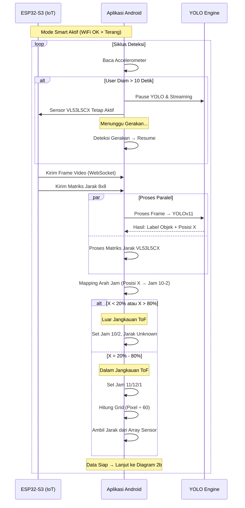
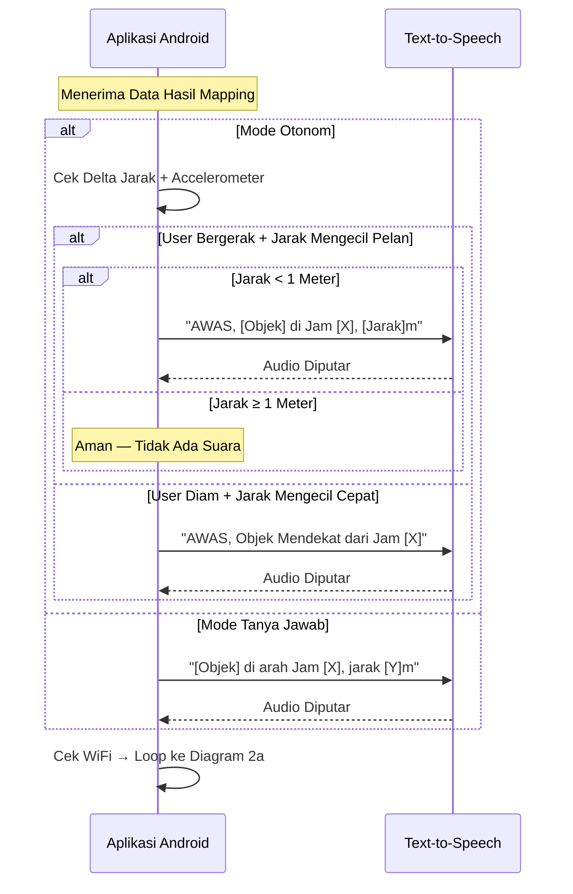
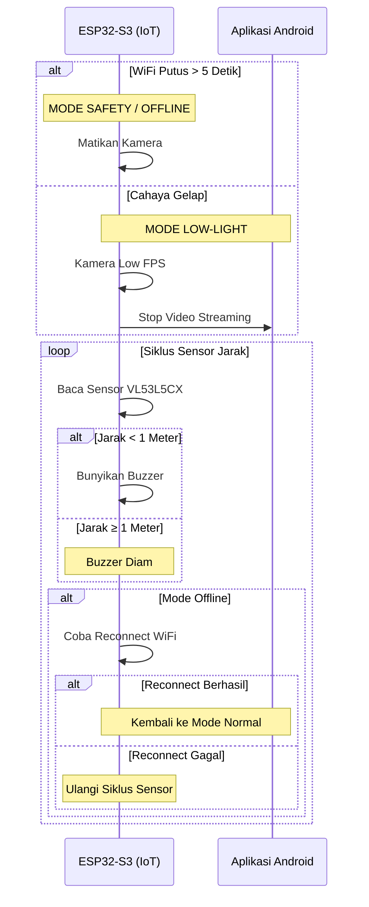

# Sequence Diagram - Sistem Kerja Perangkat

Dokumen ini menyajikan alur kerja perangkat IoT bantu navigasi tunanetra dalam bentuk **sequence diagram**. Fokus utama sequence diagram adalah **komunikasi dan urutan waktu antar aktor**: siapa mengirim data ke siapa, apa isi datanya, dan kapan komunikasi tersebut terjadi.

Terdapat empat diagram yang masing-masing merepresentasikan fase berbeda dari sistem.

**Aktor utama dalam sistem:**
| Aktor | Peran |
|---|---|
| **User** | Pengguna tunanetra yang mengoperasikan perangkat |
| **ESP32-S3 (IoT)** | Perangkat wearable yang mengirim data sensor & video |
| **Aplikasi Android** | Smartphone yang menerima, memproses, dan menghasilkan output |
| **YOLO Engine** | Modul AI YOLOv11 Nano (TFLite) di smartphone |
| **Text-to-Speech** | Modul suara Android untuk feedback audio ke user |

---

## 1. Koneksi Pertama Kali (Provisioning)

Sequence diagram ini menunjukkan alur komunikasi antara **User**, **Aplikasi Android**, dan **Perangkat IoT (ESP32)** saat proses provisioning WiFi via BLE untuk pertama kali.

**Penjelasan komunikasi antar aktor:**

1. **IoT → IoT** (Internal): Saat boot, ESP32 menginisialisasi hardware secara internal, lalu mengaktifkan BLE dalam mode *advertising* — mengirimkan sinyal broadcast agar bisa ditemukan oleh perangkat lain.
2. **User → App** (Input): User melakukan aksi manual: menyalakan Bluetooth & Hotspot di smartphone, lalu membuka aplikasi Android.
3. **App → IoT** (Request BLE Scan): Aplikasi mengirimkan perintah scan BLE ke perangkat sekitar. Komunikasi ini menggunakan protokol BLE (Bluetooth Low Energy).
4. **IoT → App** (Response): Perangkat IoT merespons dengan mengirimkan identitas perangkat (nama + MAC address) kembali ke aplikasi via BLE.
5. **User → App** (Input): User memilih perangkat IoT dari daftar yang ditampilkan di layar aplikasi.
6. **App → IoT** (Request Koneksi): Aplikasi mengirimkan request pairing/koneksi BLE ke perangkat IoT yang dipilih. Setelah berhasil, kanal komunikasi BLE dua arah terbentuk.
7. **App → IoT** (Request Scan WiFi): Melalui kanal BLE yang sudah terbentuk, aplikasi meminta IoT untuk melakukan scanning jaringan WiFi di sekitarnya.
8. **IoT → App** (Response WiFi List): IoT mengirimkan daftar SSID jaringan WiFi yang ditemukan beserta kekuatan sinyalnya ke aplikasi via BLE.
9. **User → App** (Input): User memilih jaringan WiFi dari daftar (biasanya Hotspot smartphone sendiri).
10. **App → IoT** (Kirim Kredensial): Aplikasi mengirimkan paket data berisi SSID dan password WiFi ke IoT melalui BLE. Ini adalah data satu arah (write characteristic).
11. **IoT → App** (Response Status): IoT mencoba terhubung ke WiFi dan mengirimkan status hasilnya ke aplikasi:
    - **Terhubung**: IoT menyimpan kredensial ke NVS (memori non-volatile) secara internal, lalu mengirim notifikasi sukses ke aplikasi. Kanal BLE dapat diputus — komunikasi selanjutnya via WiFi.
    - **Gagal**: IoT mengirim notifikasi gagal ke aplikasi. User dapat memilih jaringan lain tanpa perlu reconnect BLE.

---

## 2. Mode Smart / AI (Terhubung & Terang)

### 2a. Pemrosesan Data & Mapping

Sequence diagram ini menunjukkan alur komunikasi data dari **ESP32 ke Smartphone**, lalu pemrosesan paralel antara **Aplikasi** dan **YOLO Engine**. Fokus: pengiriman data sensor, waktu pemrosesan paralel, dan penggabungan hasil.

**Penjelasan komunikasi antar aktor:**

1. **App → App** (Internal): Setiap awal siklus, aplikasi membaca sensor accelerometer bawaan smartphone secara internal. Tidak ada komunikasi ke aktor lain di tahap ini.
2. **App → AI & App → IoT** (Perintah Pause): Saat user diam > 10 detik, aplikasi mengirimkan dua perintah secara bersamaan:
   - Ke **YOLO Engine**: perintah untuk menghentikan proses inferensi (pause thread AI).
   - Ke **IoT**: perintah via WebSocket agar ESP32 tetap menjalankan sensor VL53L5CX + buzzer secara mandiri (tanpa streaming video).
3. **IoT → App** (Streaming Data): ESP32 mengirimkan dua jenis data ke aplikasi secara berurutan melalui **WebSocket** (protokol real-time over WiFi):
   - **Frame video** dari kamera OV2640 — dikirim sebagai binary frame.
   - **Matriks jarak 8×8** dari sensor VL53L5CX — dikirim sebagai array numerik.
   - Kedua data dikirim dalam satu siklus, dengan delay minimal antar pengiriman (~ms).
4. **App → AI** (Request Inferensi) & **AI → App** (Response Hasil): Komunikasi paralel antara dua proses di smartphone:
   - Aplikasi mengirimkan frame video ke modul YOLO untuk diproses (inferensi TFLite). YOLO mengembalikan hasil berupa **label objek** dan **koordinat posisi X** (piksel horizontal dalam frame).
   - Secara bersamaan (`par`), aplikasi memproses matriks jarak VL53L5CX secara internal tanpa melibatkan aktor lain.
   - Kedua proses berjalan paralel untuk **menghemat waktu** — total latency = max(YOLO, ToF), bukan YOLO + ToF.
5. **App → App** (Internal Mapping): Setelah kedua hasil tersedia, aplikasi menggabungkan data secara internal:
   - Posisi X dari YOLO dipetakan ke arah jam (10-2).
   - Jika objek dalam jangkauan ToF (20%-80%), grid pixel dihitung untuk mengambil data jarak yang sesuai dari array sensor.
   - Hasil akhir: paket data berisi {objek, arah_jam, jarak} yang siap diteruskan ke tahap output (Diagram 2b).

---

### 2b. Mode Aplikasi & Keputusan Output

Sequence diagram ini menunjukkan komunikasi antara **Aplikasi** dan **Text-to-Speech (TTS)** untuk menghasilkan feedback audio ke user. Fokus: kapan dan pesan apa yang dikirim ke TTS berdasarkan mode aplikasi.

**Penjelasan komunikasi antar aktor:**

1. **App → App** (Internal): Aplikasi menerima data hasil mapping dari tahap sebelumnya (Diagram 2a) secara internal — tidak ada komunikasi jaringan karena kedua tahap berjalan di proses yang sama pada smartphone.
2. **App → App** (Internal - Mode Otonom): Pada mode otonom, aplikasi melakukan analisis internal dengan membandingkan dua data:
   - **Delta jarak**: selisih jarak objek antara frame saat ini dan frame sebelumnya (apakah jarak mengecil/membesar).
   - **Accelerometer**: apakah user sedang bergerak atau diam.
   - Analisis ini **tidak memerlukan komunikasi ke aktor lain** — murni komputasi internal.
3. **App → TTS** (Request Audio): Aplikasi mengirimkan string teks ke modul TTS Android untuk dikonversi menjadi suara. Pesan yang dikirim berbeda tergantung skenario:
   - **User mendekati objek statis (< 1m)**: `"AWAS, [nama objek] di Jam [arah], [jarak] meter"` — peringatan lengkap dengan nama objek, arah, dan jarak.
   - **Objek mendekat ke user diam**: `"AWAS, Objek Mendekat dari Jam [arah]"` — peringatan mendesak tanpa jarak (karena objek bergerak, jarak berubah cepat).
   - **Mode Tanya Jawab**: `"[nama objek] di arah Jam [arah], jarak [jarak] meter"` — informasi deskriptif tanpa kata "AWAS".
4. **TTS → App** (Callback): Setelah TTS selesai memutar audio, modul TTS mengirimkan callback ke aplikasi bahwa pemutaran selesai. Ini penting agar aplikasi tahu kapan boleh mengirim pesan TTS berikutnya (menghindari tumpang tindih suara).
5. **Tidak Ada Komunikasi (Silent)**: Pada mode otonom, jika jarak ≥ 1 meter, **tidak ada pesan yang dikirim ke TTS** — aplikasi tidak melakukan komunikasi apapun dan langsung kembali ke loop. Ini menghemat waktu siklus.
6. **App → App** (Internal - Loop): Di akhir siklus, aplikasi mengecek status koneksi WiFi secara internal sebelum kembali ke Diagram 2a untuk siklus deteksi berikutnya.

---

## 3. Mode Offline & Mode Gelap

Sequence diagram ini menunjukkan komunikasi saat kondisi non-ideal. Fokus: interaksi berubah drastis — komunikasi **App ↔ IoT terbatas** karena WiFi putus atau YOLO tidak efektif. ESP32 beroperasi lebih mandiri.

**Penjelasan komunikasi antar aktor:**

1. **Perubahan Pola Komunikasi**: Berbeda dengan Mode Smart di mana komunikasi IoT ↔ App sangat aktif (streaming video + data jarak setiap siklus), pada mode ini komunikasi **hampir berhenti**:
   - **Mode Offline**: WiFi putus — **tidak ada komunikasi** antara IoT dan App. ESP32 beroperasi sepenuhnya mandiri.
   - **Mode Gelap**: WiFi masih aktif tapi IoT mengirimkan **perintah stop streaming** (`IoT → App`) lalu komunikasi data diminimalkan.
2. **IoT → IoT** (Internal - Mode Offline): ESP32 mematikan kamera secara internal karena tanpa koneksi WiFi, tidak ada aktor yang dapat menerima frame video. Tidak ada pesan yang dikirim ke siapapun.
3. **IoT → App** (Perintah Stop - Mode Gelap): Pada mode gelap, IoT mengirimkan satu pesan via WebSocket ke aplikasi: perintah untuk menghentikan penerimaan video stream. Setelah pesan ini, **tidak ada lagi data video yang dikirim** dari IoT ke App.
4. **IoT → IoT** (Internal - Siklus Sensor): Dalam loop, ESP32 membaca data sensor VL53L5CX dan memproses hasilnya secara lokal — **tanpa mengirim data ke smartphone**. Jika jarak < 1 meter, buzzer pada perangkat IoT dibunyikan langsung oleh ESP32. Seluruh proses ini terjadi secara internal tanpa keterlibatan aktor lain.
5. **IoT → IoT** (Internal - Reconnect): Pada mode offline, ESP32 secara periodik mencoba menginisiasi ulang koneksi WiFi. Proses ini internal — tidak ada komunikasi ke App sampai koneksi berhasil.
6. **IoT → App** (Reconnect Berhasil): Saat WiFi berhasil terhubung kembali, ESP32 mengirimkan notifikasi ke aplikasi bahwa koneksi telah pulih. Komunikasi dua arah dilanjutkan dan sistem kembali ke pola komunikasi normal (Diagram 2a/2b).
