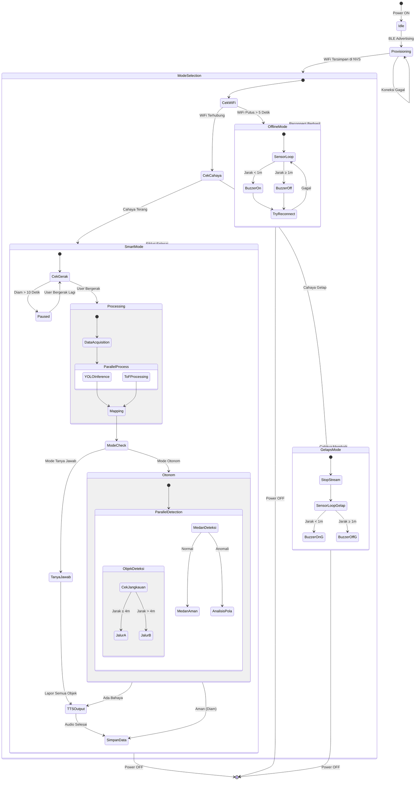
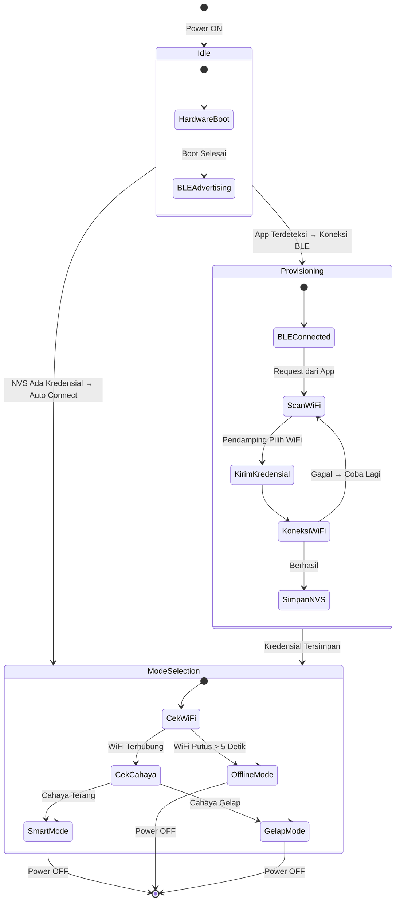
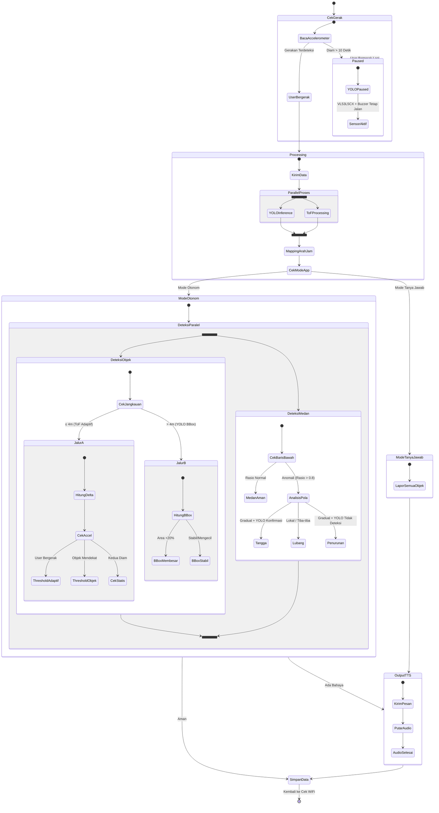
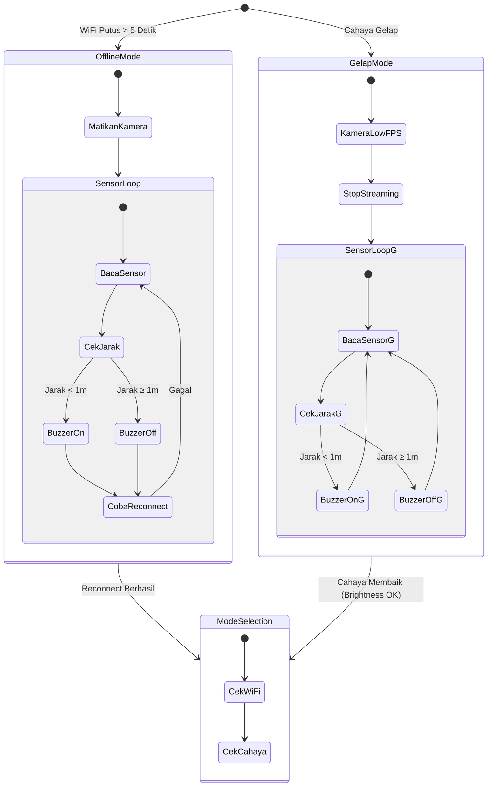

# State Machine Diagram - Sistem Bantu Navigasi Tunanetra

Dokumen ini menyajikan **State Machine Diagram (Statechart)** yang menggambarkan seluruh **state** (kondisi) yang mungkin dialami sistem dan **transisi** (perpindahan) antar kondisi tersebut beserta *trigger*-nya.

Dokumen ini sesuai dengan **sub-bab 3.5 Perancangan Logika dan Algoritma Sistem** pada BAB 3 skripsi, melengkapi flowchart di [alur-logika.md](file:///d:/Project/Skripsi/docs/alur-logika.md).

---

## State Machine Gabungan: Keseluruhan Sistem

Diagram berikut menampilkan **seluruh state dan transisi** sistem dalam satu gambar:

Diagram di atas terlalu besar untuk kertas A4. Berikut dipecah menjadi **tiga bagian**:

| Diagram | Fokus | State yang di-cover |
|---|---|---|
| **SM-1** | Siklus Hidup Sistem | Idle → Provisioning → Mode Selection |
| **SM-2** | Smart Mode (Detail) | Processing, Otonom, Tanya Jawab, Paused |
| **SM-3** | Mode Darurat | Offline Mode, Gelap Mode |

---

## SM-1. Siklus Hidup Sistem

Menampilkan state-state utama dari saat perangkat dinyalakan hingga masuk ke mode operasi.

**Penjelasan State & Transisi:**

1. **Idle** — State awal setelah power ON. ESP32 melakukan boot hardware dan mengaktifkan BLE.
   - **Transisi ke Provisioning**: Jika belum pernah terhubung WiFi (NVS kosong), masuk ke mode provisioning untuk setup awal.
   - **Transisi ke Mode Selection**: Jika NVS sudah ada kredensial WiFi, langsung auto-connect dan masuk ke pemilihan mode.
2. **Provisioning** — State setup koneksi WiFi via BLE. Dilakukan oleh **pendamping**.
   - **Internal loop**: Jika koneksi WiFi gagal, kembali ke scan WiFi (tidak keluar dari state Provisioning).
   - **Transisi ke Mode Selection**: Setelah kredensial tersimpan di NVS, pendamping tidak lagi dibutuhkan.
3. **Mode Selection** — State penentuan mode operasi. Dilakukan otomatis setiap siklus.
   - **Cek WiFi**: Prioritas pertama. Jika putus > 5 detik → Offline Mode.
   - **Cek Cahaya**: Prioritas kedua (hanya jika WiFi OK). Gelap → Gelap Mode. Terang → Smart Mode.

> **Referensi:** [alur-logika.md](file:///d:/Project/Skripsi/docs/alur-logika.md) — sub-bab 3.5.1 dan 3.5.2.

---

## SM-2. Smart Mode (Detail)

Menampilkan sub-state dalam Smart Mode — dari cek gerakan hingga output peringatan.

**Penjelasan State & Transisi:**

1. **CekGerak** — Accelerometer smartphone dibaca setiap siklus.
   - **→ Paused**: User diam > 10 detik. YOLO di-pause, tapi VL53L5CX + buzzer tetap aktif.
   - **→ Processing**: User bergerak, pemrosesan data normal dimulai.
2. **Processing** — Proses paralel: YOLO inference (frame video) dan ToF processing (matriks jarak) berjalan bersamaan, lalu hasilnya di-mapping ke arah jam menggunakan titik tengah bounding box ($X_c$) dan formula kolom ToF $C_{index} = \lfloor (X_c - 80) / 60 \rfloor$.
3. **CekModeApp** — Pilihan user (via tombol multifungsi GPIO39 — tekan singkat 1× untuk ganti mode):
   - **Otonom**: Hanya peringatan saat bahaya.
   - **Tanya Jawab**: Lapor semua objek terdeteksi.
4. **ModeOtonom — DeteksiParalel** — Tiga jalur deteksi berjalan bersamaan:
   - **JalurA** ($D \le 4$ m): Threshold adaptif $T = \min(1 + v \times 2, \ 4)$ dengan 3 cabang accelerometer (user bergerak / objek mendekat / kedua statis).
   - **JalurB** ($D > 4$ m): Delta bounding box YOLO ($\Delta A > 20\text{\%}$) untuk kendaraan mendekat.
   - **DeteksiMedan**: Analisis rasio ToF $R = \bar{D}_{bawah} / \bar{D}_{tengah}$ untuk tangga/lubang/penurunan.
5. **OutputTTS** — Pesan dikirim ke TTS, audio diputar, callback diterima. Mencegah tumpang tindih suara.

> **Referensi:** [alur-logika.md](file:///d:/Project/Skripsi/docs/alur-logika.md) — sub-bab 3.5.3 (Flowchart 3a–3e).

---

## SM-3. Mode Darurat (Offline & Gelap)

Menampilkan state-state saat kondisi non-ideal — ESP32 beroperasi mandiri.

**Penjelasan State & Transisi:**

1. **Offline Mode** — Dipicu oleh WiFi putus > 5 detik.
   - **MatikanKamera**: Kamera dimatikan untuk hemat daya. Tidak ada video, tidak ada YOLO.
   - **SensorLoop**: ESP32 beroperasi mandiri — baca sensor VL53L5CX, buzzer jika $D_{min} < 1$ m, coba reconnect WiFi setiap siklus.
   - **Transisi keluar**: Hanya saat reconnect WiFi berhasil → kembali ke Mode Selection.
   - **Threshold tetap $T = 1$ m**: Karena tidak ada accelerometer/YOLO, kecepatan pendekatan ($v$) tidak dapat dihitung.
2. **Gelap Mode** — Dipicu oleh cahaya terlalu gelap ($B_{cam} < B_{threshold}$).
   - **KameraLowFPS**: Kamera tidak dimatikan total — masih digunakan untuk cek brightness ($B_{cam}$) secara periodik.
   - **StopStreaming**: Video streaming ke smartphone dihentikan.
   - **SensorLoopG**: Logika identik dengan Offline Mode (buzzer $D_{min} < 1$ m).
   - **Transisi keluar**: Saat $B_{cam} \ge B_{threshold}$ (cahaya membaik) → kembali ke Mode Selection, potensial masuk Smart Mode.

> **Referensi:** [alur-logika.md](file:///d:/Project/Skripsi/docs/alur-logika.md) — sub-bab 3.5.4.
