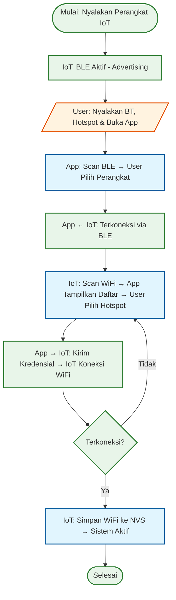

# System Workflow & Architecture

This document explains the system architecture based on `diagram-block-sistem.png` and details the initial setup workflow.

## 1. System Block Diagram Overview

The system consists of three main units:

1.  **Wearable Head Unit (IoT Device)**
    *   **ESP32-S3 (N16R8):** The core controller.
    *   **OV2640 Camera:** Captures visual data.
    *   **VL53L5CX ToF Sensor:** Measures distance (depth sensing).
    *   **Connectivity:** Communicates via WiFi (WebSocket) and Bluetooth (Provisioning).

2.  **Processing Unit (Smartphone)**
    *   **Kotlin App:** Acts as the central hub and WebSocket Server.
    *   **AI Processing:** Uses NPU/GPU to run YOLOv11 Nano (TFLite) for object detection.
    *   **Logic Fusion:** Combines visual data and distance data to make decisions.

3.  **User Interaction Unit**
    *   **Audio Output:** Text-to-Speech feedback via Bluetooth earphones.
    *   **Audio Input:** Voice commands via microphone.

## 2. Initial Setup Workflow (Provisioning)

The following flowchart illustrates the process when the device is turned on for the first time.

### Penjelasan Alur:

1.  **Memulai Program:**
    *   Nyalakan perangkat IoT.
    *   BLE pada perangkat IoT akan otomatis aktif (advertising).
2.  **Aksi User:**
    *   User menyalakan Bluetooth dan Hotspot pada smartphone.
    *   User membuka aplikasi Android.
3.  **Scanning & Koneksi BLE:**
    *   Aplikasi menampilkan menu scan BLE.
    *   User memilih perangkat IoT yang muncul di daftar scan.
4.  **Provisioning WiFi:**
    *   Setelah terkoneksi via BLE, perangkat IoT melakukan scanning WiFi di sekitar.
    *   Hasil scan dikirim ke aplikasi via BLE.
    *   User memilih WiFi (Hotspot Smartphone) dan perangkat IoT akan mencoba terhubung.
5.  **Aktivasi Sistem:**
    *   Jika koneksi WiFi berhasil, perangkat IoT menyimpan kredensial WiFi ke memori (NVS).
    *   Sistem pada blok Mobile (Processing Unit) akan aktif sepenuhnya (siap menerima stream data).
