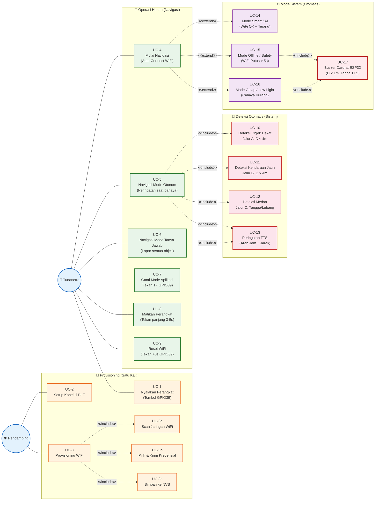

# Use Case Diagram — Sistem Bantu Navigasi Tunanetra

Dokumen ini menyajikan **Use Case Diagram** untuk sistem IoT bantu navigasi tunanetra. Diagram ini menggambarkan **seluruh interaksi** antara aktor-aktor dengan sistem dalam satu diagram terpadu. Sesuai dengan **sub-bab 3.4 Perancangan Use Case** pada BAB 3 skripsi.

---

## 1. Aktor Sistem

| Aktor | Jenis | Deskripsi | Interaksi Utama |
|---|---|---|---|
| **Tunanetra** | Primer | Pengguna utama perangkat wearable. Berinteraksi melalui suara (TTS), buzzer, LED indikator (GPIO48), dan tombol multifungsi (GPIO39) pada frame kacamata | Menyalakan perangkat, navigasi, ganti mode, matikan perangkat, reset WiFi |
| **Pendamping** | Primer | *Sighted companion* yang membantu setup awal (provisioning). **Hanya dibutuhkan satu kali** saat pertama kali menggunakan perangkat | Setup BLE, provisioning WiFi |
| **Perangkat IoT (ESP32-S3)** | Sistem | Perangkat wearable berupa kacamata yang mengambil data dari kamera OV2640 dan sensor VL53L5CX, lalu mengirim ke smartphone via WebSocket | Streaming video & data sensor, buzzer darurat, LED indikator |
| **Smartphone (Android)** | Sistem | Memproses AI (YOLOv11 TFLite), melakukan mapping arah jam & jarak, menghasilkan output TTS, dan menjadi hub komunikasi | YOLO inference, TTS output, threshold adaptif |

---

## 2. Use Case Diagram

---

## 3. Daftar Use Case

| ID | Nama Use Case | Aktor | Kategori | Deskripsi Singkat |
|---|---|---|---|---|
| UC-1 | Nyalakan Perangkat | Tunanetra | Provisioning | Menekan tombol multifungsi (GPIO39) untuk boot ESP32 |
| UC-2 | Setup Koneksi BLE | Pendamping | Provisioning | Scan dan pilih perangkat IoT dari daftar BLE di smartphone |
| UC-3 | Provisioning WiFi | Pendamping | Provisioning | Mengirim kredensial WiFi ke ESP32 via BLE |
| UC-3a | Scan Jaringan WiFi | Sistem | Provisioning | ESP32 memindai jaringan WiFi di sekitar |
| UC-3b | Pilih & Kirim Kredensial | Pendamping | Provisioning | Pendamping memilih SSID dan mengirim password |
| UC-3c | Simpan ke NVS | Sistem | Provisioning | Kredensial disimpan permanen di NVS untuk auto-connect |
| UC-4 | Mulai Navigasi | Tunanetra | Operasi | Menyalakan perangkat → auto-connect WiFi → mulai deteksi |
| UC-5 | Navigasi Mode Otonom | Tunanetra | Operasi | Mode default — hanya peringatan saat ada bahaya |
| UC-6 | Navigasi Mode Tanya Jawab | Tunanetra | Operasi | Menekan double press → sistem lapor semua objek |
| UC-7 | Ganti Mode Aplikasi | Tunanetra | Operasi | Tekan 1× singkat untuk beralih Otonom ↔ Tanya Jawab |
| UC-8 | Matikan Perangkat | Tunanetra | Operasi | Tekan panjang 3–5 detik → deep sleep |
| UC-9 | Reset WiFi | Tunanetra | Operasi | Tekan > 8 detik → hapus NVS → reboot ke provisioning |
| UC-10 | Deteksi Objek Dekat | Sistem | Deteksi | Jalur A: threshold adaptif $T = \min(1 + v \times 2, 4)$ |
| UC-11 | Deteksi Kendaraan Jauh | Sistem | Deteksi | Jalur B: delta BBox YOLO $\Delta A > 20\text{\%}$ |
| UC-12 | Deteksi Medan | Sistem | Deteksi | Jalur C: rasio ToF $R = \bar{D}_{bawah} / \bar{D}_{tengah}$ |
| UC-13 | Peringatan TTS | Sistem | Deteksi | Output suara: "Objek X di Jam Y, Z meter" |
| UC-14 | Mode Smart / AI | Sistem | Mode | WiFi OK + terang → YOLO + ToF + TTS aktif penuh |
| UC-15 | Mode Offline / Safety | Sistem | Mode | WiFi putus > 5s → ESP32 mandiri + buzzer |
| UC-16 | Mode Gelap / Low-Light | Sistem | Mode | Cahaya kurang → kamera low FPS + buzzer |
| UC-17 | Buzzer Darurat | Sistem | Mode | $D_{min} < 1$ m → buzzer langsung dari ESP32 tanpa HP |

---

## 4. Penjelasan Detail Use Case

### 4.1 Provisioning (Setup Awal — Dilakukan Satu Kali)

Tahap provisioning **hanya dilakukan satu kali** saat pertama kali menggunakan perangkat. Setelah berhasil, perangkat akan auto-connect di setiap penggunaan berikutnya tanpa perlu bantuan pendamping.

#### UC-1: Nyalakan Perangkat

- **Aktor**: Tunanetra
- **Pre-condition**: Perangkat dalam keadaan mati (deep sleep atau baru dipasang baterai)
- **Aksi**: Tunanetra menekan tombol multifungsi (GPIO39) pada gagang kacamata
- **Post-condition**: ESP32-S3 boot, LED indikator (GPIO48) berkedip cepat menandakan mode BLE Provisioning aktif
- **Catatan**: Ini adalah **satu-satunya aksi** yang dilakukan tunanetra selama proses provisioning. Semua langkah berikutnya dilakukan oleh pendamping melalui smartphone

#### UC-2: Setup Koneksi BLE

- **Aktor**: Pendamping
- **Pre-condition**: ESP32 sudah boot dan BLE Advertising aktif (LED berkedip cepat)
- **Aksi**: Pendamping menyalakan Bluetooth & WiFi Hotspot di smartphone, membuka aplikasi Android, melakukan scan BLE, dan memilih perangkat IoT dari daftar yang muncul
- **Post-condition**: Koneksi BLE terjalin antara smartphone dan ESP32
- **Catatan**: Langkah ini memerlukan **interaksi visual** dengan layar smartphone, sehingga harus dilakukan oleh pendamping yang dapat melihat

#### UC-3: Provisioning WiFi

- **Aktor**: Pendamping
- **Pre-condition**: Koneksi BLE sudah terjalin (UC-2 selesai)
- **Aksi**: Pendamping memilih jaringan WiFi (biasanya Hotspot HP sendiri), memasukkan password, dan mengirim kredensial ke ESP32
- **Post-condition**: ESP32 terhubung ke WiFi, kredensial tersimpan di NVS (Non-Volatile Storage), BLE diputus otomatis. **Setelah langkah ini, pendamping tidak lagi dibutuhkan**
- **Sub-proses (≪include≫)**:
  - **UC-3a — Scan Jaringan WiFi**: ESP32 memindai semua jaringan WiFi yang tersedia di sekitar dan mengirim daftar SSID ke aplikasi melalui BLE
  - **UC-3b — Pilih & Kirim Kredensial**: Pendamping memilih SSID dari daftar, memasukkan password, lalu aplikasi mengirim data ini ke ESP32 via BLE
  - **UC-3c — Simpan ke NVS**: Setelah ESP32 berhasil terhubung ke WiFi, kredensial (SSID + password) disimpan secara permanen di Non-Volatile Storage (NVS). Pada penggunaan berikutnya, ESP32 akan **auto-connect** tanpa proses provisioning ulang

> **Referensi:** Detail alur komunikasi provisioning ada di [sequence-diagram.md](file:///d:/Project/Skripsi/docs/sequence-diagram.md) (SD-1) dan [alur-logika.md](file:///d:/Project/Skripsi/docs/alur-logika.md) — Flowchart 3.5.2.

---

### 4.2 Operasi Harian (Navigasi — Setiap Penggunaan)

Tahap ini adalah **penggunaan sehari-hari** setelah provisioning berhasil. Tunanetra mengoperasikan perangkat secara **mandiri** tanpa bantuan pendamping. Semua interaksi melalui **satu tombol multifungsi** (GPIO39), **output suara** (TTS), **LED indikator** (GPIO48), dan **buzzer** — tidak perlu melihat layar.

#### UC-4: Mulai Navigasi

- **Aktor**: Tunanetra
- **Pre-condition**: Perangkat pernah terhubung WiFi sebelumnya (NVS sudah berisi kredensial)
- **Aksi**: Tunanetra menekan tombol multifungsi (GPIO39) untuk menyalakan perangkat
- **Post-condition**: ESP32 boot → auto-connect WiFi via NVS → WebSocket terhubung → LED menyala tetap (Mode Smart) → sistem mulai deteksi otomatis
- **Relasi ≪extend≫**: Berdasarkan kondisi lingkungan, sistem **secara otomatis** memilih salah satu mode:
  - WiFi OK + terang → **UC-14 Mode Smart** (extend)
  - WiFi putus > 5 detik → **UC-15 Mode Offline** (extend)
  - WiFi OK + gelap → **UC-16 Mode Gelap** (extend)

#### UC-5: Navigasi Mode Otonom (Mode Default)

- **Aktor**: Tunanetra (pasif — sistem bekerja otomatis)
- **Pre-condition**: Sistem dalam Mode Smart, mode aplikasi = Otonom (default)
- **Perilaku**: Sistem **diam** saat lingkungan aman. Sistem **hanya berbicara** (TTS) saat mendeteksi bahaya. Tiga jalur deteksi berjalan bersamaan secara paralel:
  - **UC-10 Deteksi Objek Dekat** (≪include≫) — Jalur A: Untuk objek dalam jangkauan sensor ToF ($D \le 4$ m). Menggunakan threshold adaptif $T = \min(1 + v \times 2,\ 4)$ yang menyesuaikan jarak peringatan berdasarkan kecepatan pendekatan. Semakin cepat objek mendekat, semakin jauh jarak peringatan diberikan
  - **UC-11 Deteksi Kendaraan Jauh** (≪include≫) — Jalur B: Untuk objek di luar jangkauan ToF ($D > 4$ m). Menggunakan perubahan area bounding box YOLO: jika $\Delta A > 20\text{\%}$ dalam satu interval frame, objek dianggap mendekat cepat (kemungkinan kendaraan)
  - **UC-12 Deteksi Medan** (≪include≫) — Jalur C: Analisis pola data sensor ToF untuk mendeteksi perubahan elevasi lantai. Rasio $R = \bar{D}_{bawah} / \bar{D}_{tengah}$ menentukan apakah ada tangga, lubang, atau penurunan di depan user
  - **UC-13 Peringatan TTS** (≪include≫) — Output akhir: TTS mengucapkan peringatan dengan format "Awas, [Objek] di Jam [X], [Y] meter". Anti-tumpang-tindih: pesan berikutnya menunggu callback dari pesan sebelumnya

#### UC-6: Navigasi Mode Tanya Jawab

- **Aktor**: Tunanetra (aktif — menekan tombol untuk bertanya)
- **Pre-condition**: Sistem dalam Mode Smart, mode aplikasi = Tanya Jawab
- **Aksi**: Tunanetra menekan tombol 2× cepat (double press GPIO39) untuk meminta laporan
- **Post-condition**: TTS menyebutkan **semua objek** yang terdeteksi beserta arah jam dan jarak masing-masing — tidak ada filter, semua informasi dilaporkan
- **Feedback**: LED indikator berkedip 2× + jeda menandakan Mode Tanya Jawab aktif
- **Relasi ≪include≫**: Juga menggunakan **UC-13 Peringatan TTS** untuk output suara

#### UC-7: Ganti Mode Aplikasi

- **Aktor**: Tunanetra
- **Pre-condition**: Sistem sedang aktif dalam salah satu mode (Otonom atau Tanya Jawab)
- **Aksi**: Tunanetra menekan tombol multifungsi 1× singkat (< 1 detik, GPIO39)
- **Post-condition**: Mode beralih antara Otonom ↔ Tanya Jawab
- **Feedback**:
  - TTS mengkonfirmasi: "Mode Otonom Aktif" atau "Mode Tanya Jawab Aktif"
  - LED indikator berubah pola: menyala tetap (Otonom) atau berkedip 2× + jeda (Tanya Jawab)

#### UC-8: Matikan Perangkat

- **Aktor**: Tunanetra
- **Pre-condition**: Sistem sedang aktif
- **Aksi**: Tunanetra menekan tombol multifungsi panjang (3–5 detik, GPIO39)
- **Post-condition**: ESP32 masuk mode deep sleep, semua sensor dimatikan
- **Feedback**: Buzzer berbunyi 2× beep pendek sebagai konfirmasi, LED mati

#### UC-9: Reset WiFi

- **Aktor**: Tunanetra
- **Pre-condition**: Sistem sedang aktif, user ingin mengganti jaringan WiFi (misalnya ganti HP baru)
- **Aksi**: Tunanetra menekan tombol multifungsi sangat panjang (> 8 detik, GPIO39)
- **Post-condition**: Kredensial WiFi di NVS dihapus, ESP32 reboot ke mode BLE Provisioning
- **Feedback**: Buzzer berbunyi 3× beep panjang, LED berkedip cepat (mode provisioning)
- **Catatan**: Setelah reset, diperlukan **pendamping** untuk melakukan provisioning WiFi ulang (UC-2 & UC-3)

> **Referensi:** Detail alur deteksi ada di [alur-logika.md](file:///d:/Project/Skripsi/docs/alur-logika.md) — Flowchart 3a–3e. Detail komunikasi antar komponen ada di [sequence-diagram.md](file:///d:/Project/Skripsi/docs/sequence-diagram.md) — SD-2 dan SD-3.

---

### 4.3 Mode Sistem (Dipilih Otomatis Oleh Sistem)

Mode sistem **bukan** dipilih oleh user — mode ini ditentukan **secara otomatis** oleh sistem berdasarkan kondisi lingkungan (status WiFi dan tingkat pencahayaan). User tidak perlu melakukan aksi apapun untuk berpindah mode.

#### UC-14: Mode Smart / AI

- **Aktor**: Sistem (otomatis)
- **Trigger**: WiFi terhubung DAN cahaya lingkungan cukup terang ($B_{cam} \ge B_{threshold}$)
- **Kemampuan**: Seluruh fitur sistem aktif:
  - Kamera OV2640 → streaming video ke smartphone via WebSocket
  - YOLOv11 Nano (TFLite) → deteksi objek real-time
  - Sensor VL53L5CX → data jarak 8×8 zona
  - Accelerometer → deteksi gerakan user
  - TTS → output suara peringatan/informasi
- **LED indikator**: Menyala tetap (solid)
- **Relasi ≪extend≫ dari UC-4**: Dipilih otomatis saat kondisi ideal terpenuhi

#### UC-15: Mode Offline / Safety

- **Aktor**: Sistem (otomatis)
- **Trigger**: Koneksi WiFi terputus selama lebih dari **5 detik** (smartphone mati, sinyal hilang, dll.)
- **Kemampuan terbatas**: Kamera dimatikan, YOLO tidak tersedia, TTS tidak bisa digunakan. ESP32 beroperasi **mandiri** hanya dengan sensor VL53L5CX + buzzer. Threshold tetap $T = 1$ meter (tidak adaptif karena accelerometer di HP tidak terjangkau)
- **LED indikator**: Berkedip lambat (1× per 2 detik)
- **Relasi ≪include≫ UC-17 Buzzer Darurat**: Buzzer dibunyikan langsung dari ESP32 saat $D_{min} < 1$ m
- **Transisi keluar**: Saat WiFi reconnect → sistem otomatis kembali ke Mode Smart

#### UC-16: Mode Gelap / Low-Light

- **Aktor**: Sistem (otomatis)
- **Trigger**: Kamera mendeteksi tingkat pencahayaan terlalu rendah ($B_{cam} < B_{threshold}$), dalam kondisi WiFi masih terhubung
- **Kemampuan terbatas**: Kamera diatur ke Low FPS (hanya untuk monitoring brightness secara periodik), video streaming dihentikan karena YOLO tidak efektif di kondisi gelap. Deteksi mengandalkan sensor VL53L5CX + buzzer — logika identik dengan Mode Offline
- **LED indikator**: Berkedip lambat (1× per 2 detik)
- **Relasi ≪include≫ UC-17 Buzzer Darurat**: Sama seperti Mode Offline
- **Transisi keluar**: Saat pencahayaan membaik ($B_{cam} \ge B_{threshold}$) → sistem otomatis kembali ke Mode Smart

#### UC-17: Buzzer Darurat ESP32

- **Aktor**: Sistem (otomatis — mekanisme fail-safe)
- **Trigger**: Sensor VL53L5CX mendeteksi objek pada jarak $D_{min} < 1$ meter, dalam kondisi Mode Offline atau Mode Gelap
- **Perilaku**: Buzzer aktif (GPIO38) dibunyikan **langsung oleh ESP32** tanpa melalui smartphone. Ini adalah lapisan keamanan terakhir — output berupa bunyi fisik dari perangkat wearable, bukan suara TTS dari HP
- **Post-condition**: Buzzer diam saat $D_{min} \ge 1$ meter
- **Catatan**: Buzzer darurat **tidak menggantikan TTS** — buzzer hanya aktif saat TTS tidak tersedia (Mode Offline / Mode Gelap). Di Mode Smart, peringatan tetap melalui TTS yang lebih informatif (arah jam + jarak)

> **Referensi:** Detail transisi mode ada di [state-machine-diagram.md](file:///d:/Project/Skripsi/docs/state-machine-diagram.md) — SM-1 dan SM-4. Detail logika darurat ada di [alur-logika.md](file:///d:/Project/Skripsi/docs/alur-logika.md) — Flowchart 3.5.5.

---

## 5. Relasi Antar Use Case

### 5.1 Relasi ≪include≫ (Ketergantungan Wajib)

| Use Case Utama | ≪include≫ | Penjelasan |
|---|---|---|
| UC-3 Provisioning WiFi | UC-3a, UC-3b, UC-3c | Provisioning WiFi **pasti** menjalankan scan → pilih → simpan |
| UC-5 Mode Otonom | UC-10, UC-11, UC-12, UC-13 | Mode Otonom **pasti** menjalankan tiga jalur deteksi + TTS |
| UC-6 Mode Tanya Jawab | UC-13 | Mode Tanya Jawab **pasti** menggunakan TTS untuk laporan |
| UC-15 Mode Offline | UC-17 | Mode Offline **pasti** mengaktifkan buzzer darurat |
| UC-16 Mode Gelap | UC-17 | Mode Gelap **pasti** mengaktifkan buzzer darurat |

### 5.2 Relasi ≪extend≫ (Ekstensi Kondisional)

| Use Case Utama | ≪extend≫ | Kondisi |
|---|---|---|
| UC-4 Mulai Navigasi | UC-14 Mode Smart | WiFi OK + cahaya terang |
| UC-4 Mulai Navigasi | UC-15 Mode Offline | WiFi putus > 5 detik |
| UC-4 Mulai Navigasi | UC-16 Mode Gelap | WiFi OK + cahaya kurang |

### 5.3 Interaksi Tombol Multifungsi (GPIO39)

Satu tombol fisik menangani **empat fungsi** berdasarkan pola tekanan, meminimalisir kebutuhan tunanetra untuk menghafal letak banyak tombol:

| Pola Tekanan | Durasi | Use Case | Feedback |
|---|---|---|---|
| Tekan singkat 1× | < 1 detik | UC-7 Ganti Mode | TTS + LED berubah pola |
| Double press 2× | 2× dalam 0.5 detik | UC-6 Trigger Tanya | TTS lapor semua objek |
| Tekan panjang | 3–5 detik | UC-8 Matikan Perangkat | Buzzer 2× beep + LED mati |
| Tekan sangat panjang | > 8 detik | UC-9 Reset WiFi | Buzzer 3× beep + LED kedip cepat |

> **Referensi:** Detail wiring tombol ada di [wiring-diagram.md](file:///d:/Project/Skripsi/docs/wiring-diagram.md) — Section 5.
