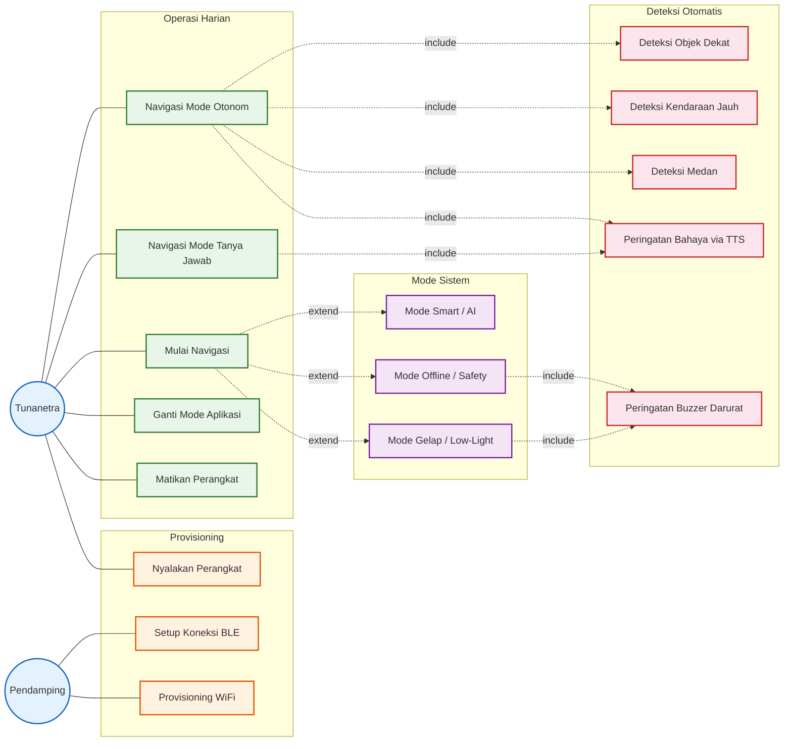
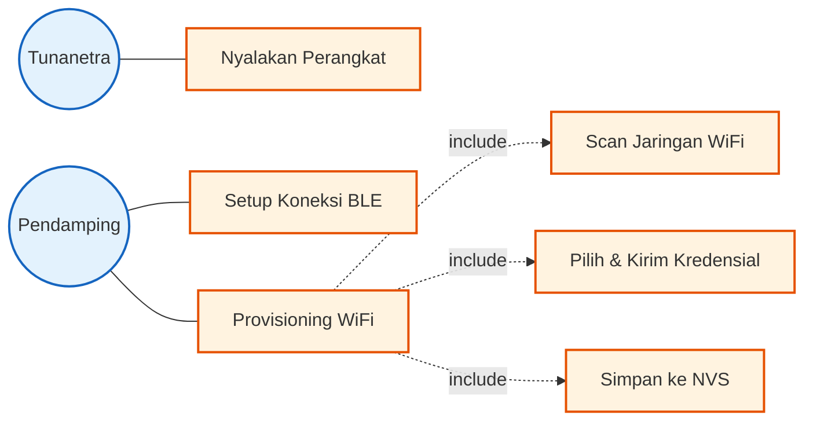
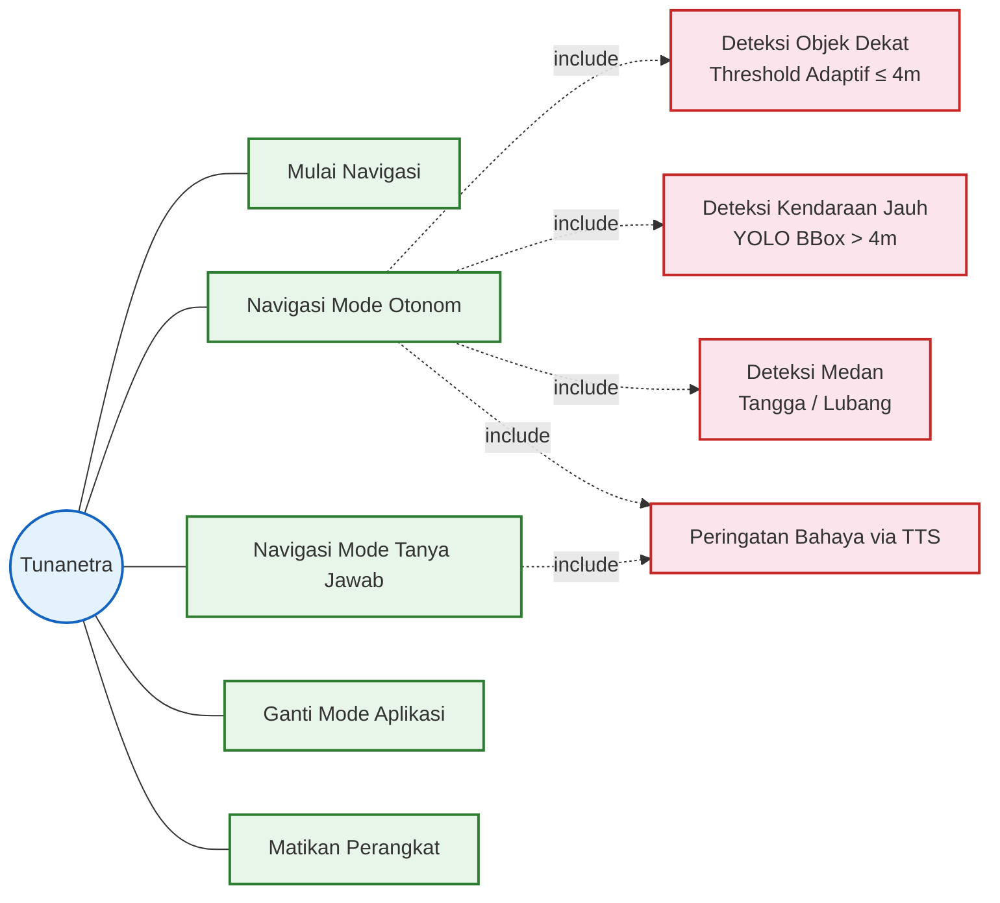
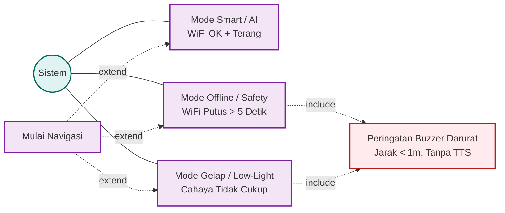

# Use Case Diagram - Sistem Bantu Navigasi Tunanetra

Dokumen ini menyajikan **Use Case Diagram** untuk sistem IoT bantu navigasi tunanetra. Diagram ini menggambarkan interaksi antara aktor-aktor dengan sistem, sesuai dengan **sub-bab 3.4 Perancangan Use Case** pada BAB 3 skripsi.

---

## Aktor Sistem

| Aktor | Jenis | Deskripsi |
|---|---|---|
| **Tunanetra** | Primer | Pengguna utama perangkat wearable. Berinteraksi melalui suara (TTS) dan tombol fisik |
| **Pendamping** | Primer | *Sighted companion* yang membantu setup awal (provisioning). Hanya dibutuhkan satu kali |
| **Perangkat IoT (ESP32)** | Sistem | Perangkat wearable yang mengambil data sensor dan video |
| **Smartphone (Android)** | Sistem | Memproses AI (YOLO), menghasilkan output TTS, dan menjadi hub komunikasi |

---

## Diagram Use Case Gabungan

Berikut keseluruhan use case sistem dalam satu diagram:

Diagram di atas menampilkan keseluruhan interaksi. Karena terlalu besar untuk kertas A4, diagram dipecah menjadi **tiga bagian** berikut:

---

## Use Case 1: Provisioning (Setup Awal)

Menampilkan interaksi saat pertama kali menyalakan perangkat. **Pendamping** melakukan langkah-langkah visual di smartphone, **Tunanetra** hanya menekan tombol fisik.

**Penjelasan Use Case:**

1. **Nyalakan Perangkat** — Tunanetra menekan tombol power pada perangkat wearable. Ini satu-satunya aksi yang dilakukan tunanetra pada tahap provisioning. ESP32-S3 boot dan mengaktifkan BLE.
2. **Setup Koneksi BLE** — Pendamping menyalakan Bluetooth & Hotspot WiFi di smartphone, membuka aplikasi Android, kemudian melakukan scan dan memilih perangkat IoT dari daftar BLE. Langkah ini memerlukan interaksi visual dengan layar sehingga dilakukan pendamping.
3. **Provisioning WiFi** — Pendamping memilih jaringan WiFi (biasanya Hotspot HP sendiri) dan mengirimkan kredensialnya ke perangkat IoT. Terdiri dari tiga sub-proses:
   - **Scan Jaringan WiFi**: IoT memindai jaringan WiFi di sekitar dan mengirim hasilnya ke aplikasi.
   - **Pilih & Kirim Kredensial**: Pendamping memilih SSID, lalu aplikasi mengirim SSID + password ke IoT.
   - **Simpan ke NVS**: Setelah koneksi berhasil, kredensial disimpan permanen agar auto-connect di sesi berikutnya. **Setelah langkah ini, pendamping tidak lagi dibutuhkan.**

> **Referensi:** Detail alur provisioning ada di [alur-logika.md](file:///d:/Project/Skripsi/docs/alur-logika.md) — sub-bab 3.5.1 (Flowchart Provisioning).

---

## Use Case 2: Operasi Harian (Navigasi)

Menampilkan interaksi tunanetra saat penggunaan sehari-hari. Semua interaksi melalui **suara (TTS)** dan **tombol fisik** — tidak perlu melihat layar.

**Penjelasan Use Case:**

1. **Mulai Navigasi** — Tunanetra menyalakan perangkat (tombol power). Sistem auto-connect ke WiFi via kredensial NVS, menginisialisasi sensor, dan otomatis memilih mode berdasarkan kondisi (WiFi + cahaya). Tidak perlu bantuan pendamping.
2. **Navigasi Mode Otonom** — Mode default. Sistem **hanya memperingatkan** saat ada bahaya — tidak memberikan informasi jika aman. Secara otomatis menjalankan tiga jalur deteksi:
   - **Deteksi Objek Dekat (≤ 4m)**: Menggunakan threshold adaptif berdasarkan kecepatan pendekatan (Flowchart 3c).
   - **Deteksi Kendaraan Jauh (> 4m)**: Menggunakan delta bounding box YOLO untuk mendeteksi objek mendekat cepat (Flowchart 3d).
   - **Deteksi Medan**: Menganalisis pola ToF untuk mengenali tangga, lubang, atau parit (Flowchart 3e).
3. **Navigasi Mode Tanya Jawab** — Tunanetra menekan tombol untuk bertanya, sistem menyebutkan **semua objek** yang terdeteksi beserta arah dan jarak. Tidak ada filter — semua informasi dilaporkan.
4. **Ganti Mode Aplikasi** — Tunanetra menekan tombol fisik untuk beralih antara Mode Otonom dan Mode Tanya Jawab. Feedback suara mengkonfirmasi mode yang aktif.
5. **Matikan Perangkat** — Tunanetra menekan tombol power (long press) untuk mematikan sistem.

> **Referensi:** Detail logika deteksi ada di [alur-logika.md](file:///d:/Project/Skripsi/docs/alur-logika.md) — sub-bab 3.5.3 (Flowchart 3a–3e).

---

## Use Case 3: Mode Sistem (Otomatis)

Menampilkan mode-mode yang **dipilih otomatis oleh sistem** berdasarkan kondisi lingkungan — bukan input dari user.

**Penjelasan Use Case:**

1. **Mode Smart / AI** — Aktif saat WiFi terhubung DAN cahaya cukup terang. Seluruh kemampuan sistem digunakan: kamera + YOLO + ToF + accelerometer. Menghasilkan output TTS yang informatif.
2. **Mode Offline / Safety** — Aktif otomatis saat WiFi putus lebih dari 5 detik. Kamera dimatikan, YOLO tidak bisa digunakan. ESP32 beroperasi mandiri dengan sensor VL53L5CX + buzzer saja. Threshold tetap 1 meter.
3. **Mode Gelap / Low-Light** — Aktif saat kamera mendeteksi kondisi cahaya terlalu gelap untuk YOLO. Kamera Low FPS (untuk pengecekan brightness periodik), video streaming dihentikan. Deteksi mengandalkan sensor VL53L5CX + buzzer.
4. **Peringatan Buzzer Darurat** — Di-*include* oleh Mode Offline dan Mode Gelap. Buzzer pada ESP32 dibunyikan langsung (tanpa melalui smartphone) saat sensor mendeteksi objek pada jarak < 1 meter. Ini adalah mekanisme fail-safe terakhir jika TTS tidak tersedia.

> **Referensi:** Detail logika mode ada di [alur-logika.md](file:///d:/Project/Skripsi/docs/alur-logika.md) — sub-bab 3.5.2 (Penentuan Mode) dan 3.5.4 (Mode Darurat).
