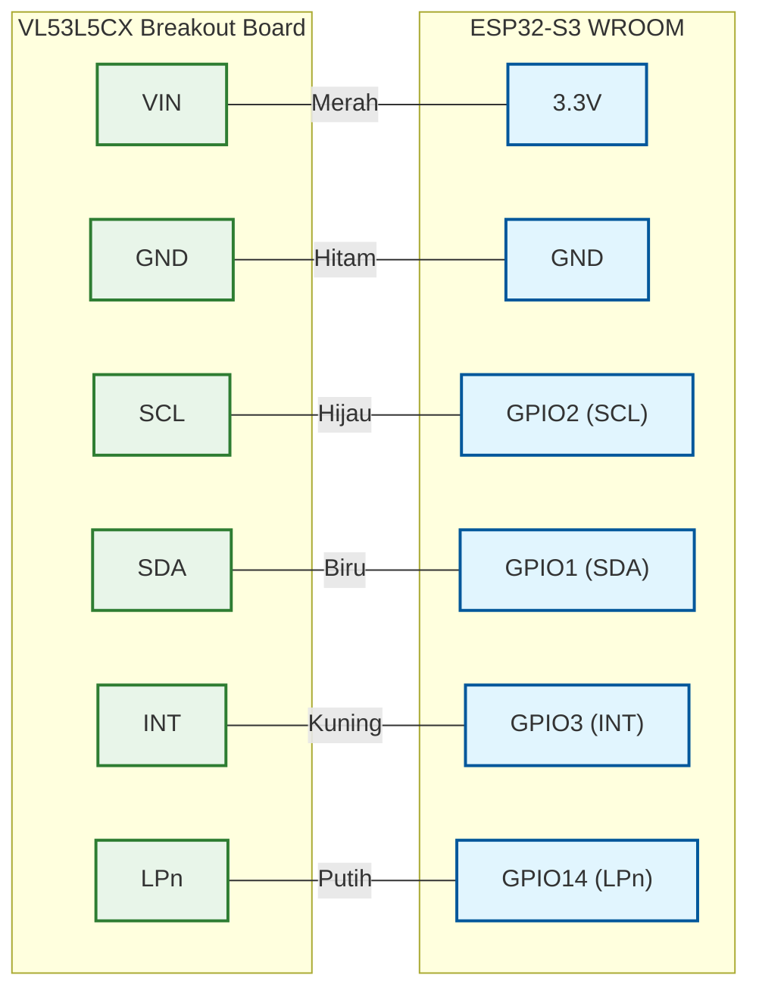
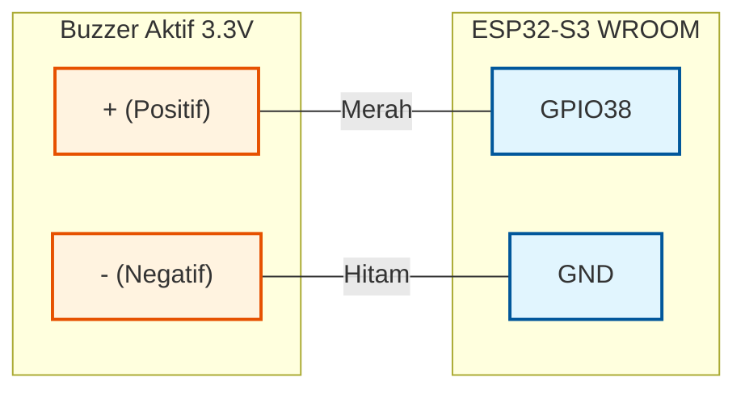
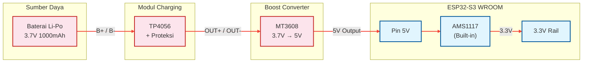
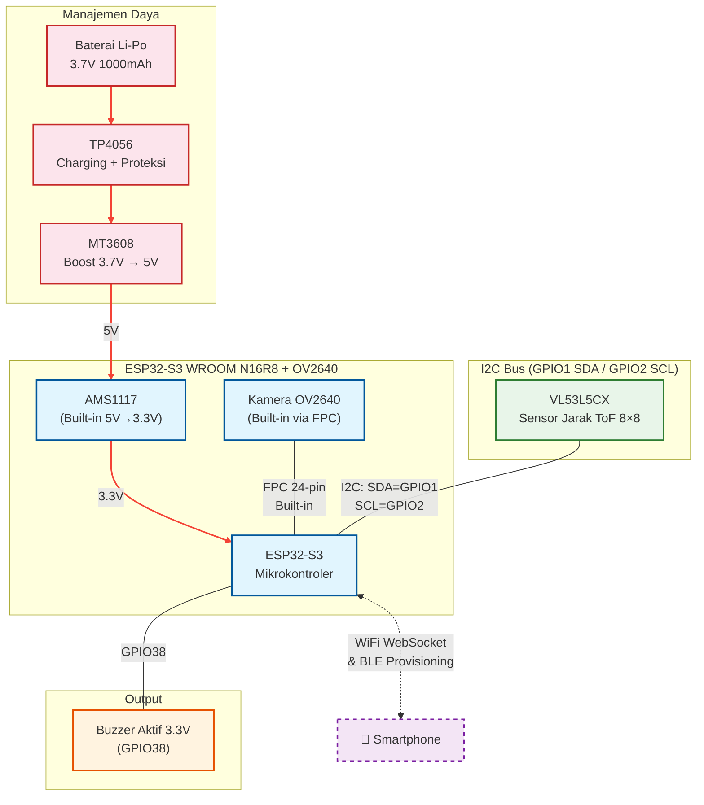

# Wiring Diagram — Perangkat Kacamata Pintar

Dokumen ini menjelaskan skema koneksi (wiring) seluruh komponen hardware pada perangkat wearable berdasarkan diagram blok sistem.

**Board yang digunakan:** ESP32-S3 WROOM N16R8 + Kamera OV2640 2MP (Freenove / Generic)

---

## 1. Pin Mapping — Kamera OV2640 (Built-in)

Kamera OV2640 sudah **terhubung langsung** ke board ESP32-S3 WROOM melalui konektor FPC 24-pin. **Tidak perlu wiring manual.** Pin-pin berikut sudah digunakan oleh kamera dan **tidak boleh dipakai** untuk komponen lain.

| Fungsi Kamera | GPIO | Keterangan |
|---|---|---|
| XCLK | GPIO15 | External clock |
| SIOD (SDA) | GPIO4 | I2C SDA (kontrol kamera) |
| SIOC (SCL) | GPIO5 | I2C SCL (kontrol kamera) |
| D0 (Y2) | GPIO11 | Data bit 0 |
| D1 (Y3) | GPIO9 | Data bit 1 |
| D2 (Y4) | GPIO8 | Data bit 2 |
| D3 (Y5) | GPIO10 | Data bit 3 |
| D4 (Y6) | GPIO12 | Data bit 4 |
| D5 (Y7) | GPIO18 | Data bit 5 |
| D6 (Y8) | GPIO17 | Data bit 6 |
| D7 (Y9) | GPIO16 | Data bit 7 |
| VSYNC | GPIO6 | Vertical sync |
| HREF | GPIO7 | Horizontal reference |
| PCLK | GPIO13 | Pixel clock |

> **Total GPIO dipakai kamera: 14 pin** — sisa GPIO tersedia untuk sensor, buzzer, dan tombol.

---

## 2. Pin Mapping — Sensor VL53L5CX (I2C)

Sensor jarak Time-of-Flight VL53L5CX terhubung ke ESP32 via **I2C**. Menggunakan GPIO yang **berbeda** dari I2C kamera (kamera pakai GPIO4/GPIO5).



| Pin VL53L5CX | Pin ESP32 | Warna Kabel | Keterangan |
|---|---|---|---|
| **VIN** | **3.3V** | 🔴 Merah | Power supply 3.3V dari board |
| **GND** | **GND** | ⚫ Hitam | Ground |
| **SCL** | **GPIO2** | 🟢 Hijau | I2C Clock |
| **SDA** | **GPIO1** | 🔵 Biru | I2C Data |
| **INT** | **GPIO3** | 🟡 Kuning | Interrupt (data ready) — opsional |
| **LPn** | **GPIO14** | ⚪ Putih | Low Power enable — opsional |

**Catatan penting:**
- GPIO1 dan GPIO2 dipilih karena **tidak dipakai** oleh kamera dan merupakan pin I2C kedua yang umum dipakai di ESP32-S3.
- Kamera menggunakan I2C pada GPIO4 (SDA) dan GPIO5 (SCL) — ini adalah **bus I2C terpisah**, sehingga tidak ada konflik.
- Pin **INT** dan **LPn** bersifat opsional. INT digunakan jika ingin interrupt-driven reading (lebih efisien). LPn digunakan untuk mengontrol mode low-power sensor.

---

## 3. Pin Mapping — Buzzer Aktif (Fail-Safe)

Buzzer aktif terhubung langsung ke GPIO ESP32. Buzzer aktif hanya membutuhkan sinyal HIGH/LOW (tidak perlu PWM frekuensi tertentu).



| Pin Buzzer | Pin ESP32 | Warna Kabel | Keterangan |
|---|---|---|---|
| **+ (Positif)** | **GPIO38** | 🔴 Merah | Sinyal kontrol (HIGH = bunyi) |
| **- (Negatif)** | **GND** | ⚫ Hitam | Ground |

**Catatan:**
- Gunakan **buzzer aktif 3.3V** (bukan pasif) agar bisa dikontrol hanya dengan `digitalWrite(38, HIGH)`.
- GPIO38 dipilih karena tersedia dan aman untuk output digital.
- Jika arus buzzer > 12mA (batas GPIO ESP32), tambahkan **transistor NPN** (misalnya 2N2222) sebagai driver.

---

## 4. Wiring — Manajemen Daya (Li-Po + TP4056 + MT3608)

Karena board ESP32-S3 WROOM menggunakan regulator **AMS1117-3.3V** (dropout ~1.1V, minimum input 4.4V), baterai Li-Po 3.7V **tidak bisa langsung** masuk ke pin 5V. Diperlukan **boost converter MT3608** untuk menaikkan tegangan ke 5V.

### Jalur Daya

```
Li-Po 3.7V → TP4056 (Charging + Proteksi) → MT3608 (Boost 3.7V → 5V) → Pin 5V ESP32 → AMS1117 (5V → 3.3V)
```



### Tabel Koneksi Daya

| Dari | Pin | Ke | Pin | Warna Kabel | Keterangan |
|---|---|---|---|---|---|
| **Li-Po +** | Kabel Merah | **TP4056** | B+ | 🔴 Merah | Positif baterai |
| **Li-Po -** | Kabel Hitam | **TP4056** | B- | ⚫ Hitam | Negatif baterai |
| **TP4056** | OUT+ | **MT3608** | IN+ (VIN) | 🔴 Merah | Output baterai → input boost |
| **TP4056** | OUT- | **MT3608** | IN- (GND) | ⚫ Hitam | Ground |
| **MT3608** | OUT+ (VOUT) | **ESP32** | Pin 5V | 🔴 Merah | 5V output → board |
| **MT3608** | OUT- (GND) | **ESP32** | GND | ⚫ Hitam | Ground bersama |

### Catatan Penting

- **MT3608 harus di-set ke 5V** sebelum dihubungkan ke ESP32. Putar trimpot pada modul MT3608 sambil mengukur output dengan multimeter hingga tepat **5.0V**.
- **TP4056 berfungsi ganda**: (1) mengisi baterai saat USB terhubung ke TP4056, (2) proteksi over-discharge/over-charge baterai.
- **Charging**: Untuk mengisi baterai, hubungkan kabel Micro-USB ke **TP4056** (bukan ke ESP32). ESP32 tetap menyala saat baterai di-charge.
- **AMS1117** bawaan board menangani konversi 5V → 3.3V. Semua komponen (ESP32, kamera, sensor) mendapat daya 3.3V dari regulator ini.

### ⚠️ Peringatan: Jangan Hubungkan USB-C dan MT3608 Bersamaan

Pin 5V pada board ESP32-S3 WROOM bersifat **bidirectional** (bisa input dan output). Hal ini menimbulkan risiko jika dua sumber daya terhubung secara bersamaan:

| Kondisi | Aman? | Keterangan |
|---|---|---|
| Hanya MT3608 → Pin 5V (tanpa USB) | ✅ Aman | Mode operasi normal (wearable) |
| Hanya USB-C (tanpa MT3608) | ✅ Aman | Mode programming / debugging |
| USB-C + MT3608 bersamaan | ❌ Bahaya | Dua sumber tegangan bertabrakan → risiko kerusakan board/komponen |

**Prosedur aman saat upload kode:**
1. **Lepas** kabel MT3608 dari pin 5V ESP32
2. **Colok** USB-C ke ESP32 untuk upload/debug
3. **Cabut** USB-C setelah selesai
4. **Pasang kembali** kabel MT3608 ke pin 5V

**Solusi permanen (opsional):** Pasang **dioda Schottky** (misalnya 1N5817) di jalur output MT3608 → Pin 5V. Dioda ini mencegah arus dari USB back-feed ke MT3608, sehingga kedua sumber bisa terhubung bersamaan dengan aman.

---

## 5. Pin Mapping — Tombol Power/Reset

Tombol push button sederhana untuk reset manual perangkat.

| Pin Tombol | Pin ESP32 | Keterangan |
|---|---|---|
| **Pin 1** | **GPIO0 (BOOT)** | Tombol boot bawaan board (sudah ada di kebanyakan dev board) |
| **Pin 2** | **GND** | Ground |

**Catatan:**
- Kebanyakan board ESP32-S3 WROOM sudah memiliki tombol **BOOT** dan **RST** built-in, sehingga **tidak perlu wiring tambahan**.
- Jika ingin menambahkan tombol custom, gunakan GPIO yang tersedia (misalnya GPIO39) dengan resistor pull-up internal: `pinMode(39, INPUT_PULLUP)`.

---

## 6. Ringkasan GPIO — Seluruh Komponen

### GPIO yang Digunakan

| GPIO | Fungsi | Komponen |
|---|---|---|
| GPIO4 | SIOD (I2C SDA) | Kamera OV2640 |
| GPIO5 | SIOC (I2C SCL) | Kamera OV2640 |
| GPIO6 | VSYNC | Kamera OV2640 |
| GPIO7 | HREF | Kamera OV2640 |
| GPIO8 | Y4 (Data 2) | Kamera OV2640 |
| GPIO9 | Y3 (Data 1) | Kamera OV2640 |
| GPIO10 | Y5 (Data 3) | Kamera OV2640 |
| GPIO11 | Y2 (Data 0) | Kamera OV2640 |
| GPIO12 | Y6 (Data 4) | Kamera OV2640 |
| GPIO13 | PCLK | Kamera OV2640 |
| GPIO15 | XCLK | Kamera OV2640 |
| GPIO16 | Y9 (Data 7) | Kamera OV2640 |
| GPIO17 | Y8 (Data 6) | Kamera OV2640 |
| GPIO18 | Y7 (Data 5) | Kamera OV2640 |
| GPIO1 | I2C SDA | VL53L5CX |
| GPIO2 | I2C SCL | VL53L5CX |
| GPIO3 | INT (opsional) | VL53L5CX |
| GPIO14 | LPn (opsional) | VL53L5CX |
| GPIO38 | Buzzer Output | Buzzer Aktif |

### GPIO yang Masih Tersedia

| GPIO | Status | Catatan |
|---|---|---|
| GPIO0 | ⚠️ Strapping | Tombol BOOT bawaan board |
| GPIO19 | ✅ Tersedia | USB D- (jangan pakai jika pakai USB native) |
| GPIO20 | ✅ Tersedia | USB D+ (jangan pakai jika pakai USB native) |
| GPIO21 | ✅ Tersedia | General purpose |
| GPIO39 | ✅ Tersedia | General purpose |
| GPIO40 | ✅ Tersedia | General purpose |
| GPIO41 | ✅ Tersedia | General purpose |
| GPIO42 | ✅ Tersedia | General purpose |
| GPIO43 | ✅ Tersedia | TX (default Serial) |
| GPIO44 | ✅ Tersedia | RX (default Serial) |
| GPIO45 | ⚠️ Strapping | Boot mode select |
| GPIO46 | ⚠️ Strapping | Boot mode select |
| GPIO47 | ✅ Tersedia | General purpose |
| GPIO48 | ✅ Tersedia | General purpose (LED bawaan di beberapa board) |

---

## 7. Skema Wiring Lengkap

Diagram koneksi seluruh komponen ke ESP32-S3 WROOM:



**Catatan akhir:**
- **Power**: Li-Po 3.7V → TP4056 (charging/proteksi) → MT3608 (boost ke 5V) → Pin 5V board → AMS1117 bawaan (5V → 3.3V).
- **Charging**: Colok Micro-USB ke **TP4056** untuk mengisi baterai. ESP32 tetap menyala saat charging.
- **MT3608**: Harus di-set ke **5.0V** via trimpot sebelum dihubungkan.
- **Kamera**: Built-in via FPC, tidak perlu wiring tambahan.
- **VL53L5CX**: Wiring manual ke I2C (4 kabel wajib + 2 opsional).
- **Buzzer**: 2 kabel (positif ke GPIO38, negatif ke GND).
